# Autonomous Graph-Driven DevSecOps Engine

> **Версия**: 0.6.0 (Phase 1–15 — Hyperscale Security Architecture)  
> **Дата**: 2026-03-11  
> **Стек**: Tauri v2 + React 19 + Rust + SQLite + Amazon Bedrock + Datalog

```
Codebase → AST Graph → Attack Graph (Datalog) → Actor Runtime → AI Swarm (7 agents) → Self-Healing Git Patch
```

### 5 вычислительных парадигм в одном Runtime

| Парадигма | Реализация | Ключевые файлы |
|-----------|-----------|----------------|
| **Erlang/OTP Actors** | `SwarmBus` broadcast + `ActorRegistry` | `actor_registry.rs`, `agents/` |
| **Datalog Reasoning** | `Crepe` DB — FlowsTo, Tainted, Edge | `secql.rs` |
| **Multi-Agent AI** | 8 агентов: Threat → Patch → Review → Compliance → Test → Fuzz → AttackPathAI → ExploitSim | `agents/`, `lib.rs` |
| **Reactive Graph** | `notify` file watcher → AST invalidation cascade → auto-scan | `scheduler.rs`, `ast_actor.rs` |
| **Self-Healing Pipeline** | Nova generate → `cargo check` loop → Git auto-commit | `patch_generator.rs`, `git_agent.rs` |

### Graph-of-Graphs → Файл

```
MetaGraph (meta_graph.rs)
   |
   +--- AST Graph        → supply_chain.rs (syn parser: Functions, Imports, Endpoints)
   +--- Dependency Graph  → supply_chain.rs (Cargo.lock → BuildGraph)
   +--- SBOM Graph        → sbom_graph.rs (CycloneDX 1.5 → typed nodes)
   +--- Attack Graph      → attack_graph.rs (petgraph + Dijkstra shortest path)
   +--- Trust Graph       → trust_graph.rs (BFS trust propagation)
   +--- Build Graph       → supply_chain.rs (Pipeline DAG execution)
   +--- Execution Graph   → engine/graph.rs (DAG executor)
```

> Все графы хранятся в `petgraph::Graph`. Datalog (`secql.rs` / Crepe) выполняет reasoning поверх.

### SwarmEvent (13 вариантов — graph-scheduled)

| Событие | Агент-источник | Реактивные агенты |
|---------|----------------|-------------------|
| `ThreatDetected` | ThreatIntel | PatchAgent |
| `DependencyRisk` | DependencyAgent | ThreatIntel |
| `PolicyViolation` | ComplianceAgent | PatchAgent |
| `ReviewRequested` | PatchAgent | Reviewer |
| `ReviewResult` | Reviewer | PatchAgent, ComplianceAgent |
| `TestPassed` | TestAgent | FuzzAgent, Git |
| `TestFailed` | TestAgent | PatchAgent (retry) |
| `FuzzResult` | FuzzAgent | Git |
| `PatchApplied` | PatchAgent | ComplianceAgent |
| `ComplianceResult` | ComplianceAgent | Git |
| `RollbackPerformed` | Git | PatchAgent |
| `ExploitChainDetected` | AttackPathAI | all agents |
| `ExploitSimulation` | ExploitSim Engine | ThreatIntel, PatchAgent |

---

## 1. Общая архитектура (High-Level Overview)

Приложение построено по классической модели **Tauri v2**: Rust-бэкенд управляет нативными операциями, а React SPA обеспечивает UI. Между ними — IPC-мост через `invoke()` / `emit()`.

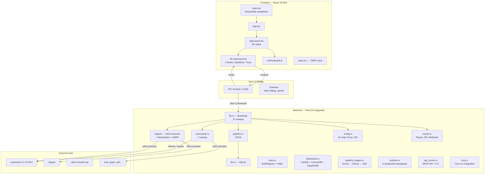

**Пояснение:**  
Архитектура приложения разделена на **четыре слоя**:

- **Frontend (React 19 SPA)** — пользовательский интерфейс, реализованный как одностраничное приложение на React 19. Внутри `AppLayout.tsx` — 36 табов навигации, 40 компонентов (включая `RulesPanel`, `DataStorePanel`, `TrivyScanPanel`, `SarifViewer`). Backend содержит 12 Rust-модулей, 37 Tauri-команд, интеграцию с Trivy CLI, 6 профилей валидации (NIST, NTIA, EU CRA), REST API для CI/CD, и multi-stage enrichment pipeline.

- **Tauri v2 Bridge** — промежуточный слой, обеспечивающий взаимодействие между JavaScript-фронтендом и Rust-бэкендом. Используются два механизма: `invoke()` (вызов Rust-команд из JS с ожиданием результата) и `emit()` / `listen()` (асинхронная потоковая передача событий от Rust к JS). Три плагина Tauri расширяют возможности: `shell` (запуск процессов), `dialog` (нативные диалоги открытия файлов), `opener` (открытие URL/файлов в системном приложении).

- **Backend (Rust)** — ядро приложения, включающее: `commands.rs` (7 обработчиков), `pipeline.rs` (CRUD), `engine/` (DAG-исполнитель с retry и SARIF), `config.rs` (air-gap, proxy, SSL, версии инструментов), `export.rs` (экспорт отчётов, ZIP-диагностика, webhook).

- **External Tools** — внешние бинарные утилиты, вызываемые бэкендом: `cyclonedx CLI v0.30.0` (sidecar, упакованный в бандл), `cdxgen` (генерация SBOM из исходного кода), `sbom-checker-go` (sidecar для проверки SBOM), а также любые утилиты из PATH: `trivy`, `grype`, `syft` и другие.

---

## 2. Структура файлов проекта

```mermaid
graph LR
    subgraph "cyclonedx-tauri-ui/"
        direction TB
        Root["📁 Корень"]
        IndexHtml["index.html"]
        PkgJson["package.json"]
        ViteConf["vite.config.ts"]
        TsConf["tsconfig.json"]

        subgraph "src/"
            MainTsx2["main.tsx"]
            AppTsx2["App.tsx"]
            AppCss2["App.css"]
            
            subgraph "components/ — 37 файлов"
                AppLayoutF["AppLayout.tsx"]
                RunnerF["CycloneDXRunner.tsx"]
                DagF["DagPipelineBuilder.tsx"]
                SarifF["SarifViewer.tsx"]
                OtherComps["...33 других"]]
            end

            subgraph "hooks/"
                UseKb["useKeyboard.ts"]
            end
        end

        subgraph "src-tauri/"
            CargoToml["Cargo.toml"]
            TauriConf["tauri.conf.json"]
            BuildRs2["build.rs"]

            subgraph "src/"
                MainRs["main.rs"]
                LibRs["lib.rs"]
                CmdRs["commands.rs"]
                DbRs["db.rs"]
                ConfigRs["config.rs"]
                ExportRs["export.rs"]
                PipeRs["pipeline.rs"]

                subgraph "engine/"
                    ModRs["mod.rs"]
                    NodesRs["nodes.rs"]
                    ArtifactRs["artifact.rs"]
                    ContextRs["context.rs"]
                    GraphRs["graph.rs"]
                    StoreRs["store.rs"]
                end
            end

            subgraph "binaries/"
                CdxBin["cyclonedx"]
                SbomBin["sbom-checker-go"]
            end
        end
    end
```

**Пояснение:**  
Проект организован в две корневые директории, отражающие разделение на фронтенд и бэкенд:

- **`src/`** — фронтенд-код на TypeScript/React. Точка входа `main.tsx` создаёт React-корень. `App.tsx` — минимальный враппер, делегирующий рендеринг `AppLayout`. Директория `components/` содержит **36 файлов** — каждый компонент отвечает за отдельную функциональную панель приложения (валидация, слияние, сравнение BOM и т.д.). Единственный хук `useKeyboard.ts` — централизованная обработка горячих клавиш.

- **`src-tauri/`** — Rust-бэкенд. Конфигурация сборки в `Cargo.toml`, настройки Tauri в `tauri.conf.json`. Директория `src/` содержит 5 файлов верхнего уровня и подмодуль `engine/` из 6 файлов. В `binaries/` хранятся sidecar-бинарники (`cyclonedx`, `sbom-checker-go`), которые автоматически упаковываются в Bundle при сборке.

- **Корневые файлы**: `index.html` (точка входа Vite), `package.json` (зависимости NPM), `vite.config.ts` (конфигурация сборщика), `tsconfig.json` (настройки TypeScript).

---

## 3. Rust Backend — модульная структура

```mermaid
graph TB
    subgraph "lib.rs — Точка входа"
        TauriBuilder["tauri::Builder::default()"]
        PluginOpener["plugin: opener"]
        PluginShell["plugin: shell"]
        PluginDialog["plugin: dialog"]
        Setup["setup: init_db() → app.manage(DbState)"]
        InvokeHandler["invoke_handler: 22 команды"]
    end

    subgraph "commands.rs — Команды запуска"
        RunCdx["run_cyclonedx<br/>sidecar, sync"]
        RunStream["run_cyclonedx_streaming<br/>sidecar, events"]
        RunExt["run_external_tool<br/>tokio::process::Command"]
        RunSidecar["run_sidecar<br/>generic sidecar"]
        ReadFile["read_file_contents"]
        WriteFile["write_file_contents"]
        DiffBoms["diff_boms"]
    end

    subgraph "pipeline.rs — CRUD пайплайнов"
        PCreate["pipeline_create"]
        PUpdate["pipeline_update_step"]
        PAddArt["pipeline_add_artifact"]
        PList["pipeline_list"]
        PGet["pipeline_get"]
        PDelete["pipeline_delete"]
    end

    subgraph "engine/mod.rs — DAG исполнитель"
        EngineList["engine_list_node_types"]
        EngineExec["engine_execute"]
        EngineSarif["engine_export_sarif"]
    end

    subgraph "config.rs — Конфигурация"
        GetConfig["get_config"]
        SaveConfig["save_config"]
        CheckTools["check_tool_versions"]
    end

    subgraph "export.rs — Экспорт"
        ExportReport["export_report"]
        CollectDiag["collect_diagnostics"]
        SendWebhook["send_webhook"]
    end

    TauriBuilder --> PluginOpener
    TauriBuilder --> PluginShell
    TauriBuilder --> PluginDialog
    TauriBuilder --> Setup
    TauriBuilder --> InvokeHandler

    InvokeHandler --> RunCdx
    InvokeHandler --> RunStream
    InvokeHandler --> RunExt
    InvokeHandler --> RunSidecar
    InvokeHandler --> ReadFile
    InvokeHandler --> WriteFile
    InvokeHandler --> DiffBoms
    InvokeHandler --> PCreate
    InvokeHandler --> PUpdate
    InvokeHandler --> PAddArt
    InvokeHandler --> PList
    InvokeHandler --> PGet
    InvokeHandler --> PDelete
    InvokeHandler --> EngineList
    InvokeHandler --> EngineExec
    InvokeHandler --> EngineSarif
    InvokeHandler --> GetConfig
    InvokeHandler --> SaveConfig
    InvokeHandler --> CheckTools
    InvokeHandler --> ExportReport
    InvokeHandler --> CollectDiag
    InvokeHandler --> SendWebhook
```

**Пояснение:**  
Rust-бэкенд построен вокруг `lib.rs`, который инициализирует приложение Tauri через `tauri::Builder`. Процесс инициализации включает:

1. **Подключение плагинов**: `opener` (открытие ссылок и файлов в системных приложениях), `shell` (запуск дочерних процессов и sidecar-бинарников), `dialog` (нативные диалоги выбора файлов).

2. **Setup-фаза**: создание и инициализация SQLite базы данных. Функция `db::init_db()` создаёт файл `pipeline.db` в каталоге данных приложения, выполняет миграции (3 таблицы + индексы) и оборачивает `Connection` в `Mutex` для потокобезопасного доступа. Полученный `DbState` регистрируется через `app.manage()` и становится доступен во всех командах как `State<DbState>`.

3. **Регистрация 22 команд** через `generate_handler![]`, разделённых на пять групп:
   - **CycloneDX-команды** (7) в `commands.rs`
   - **Pipeline CRUD** (6) в `pipeline.rs`
   - **Engine** (3) в `engine/mod.rs`: `engine_list_node_types`, `engine_execute`, `engine_export_sarif`
   - **Configuration** (3) в `config.rs`: `get_config`, `save_config`, `check_tool_versions`
   - **Export** (3) в `export.rs`: `export_report`, `collect_diagnostics`, `send_webhook`

---

## 4. DAG Execution Engine — ядро пайплайна

Движок выполняет направленный ацикличный граф (DAG) узлов. Каждый узел обрабатывает артефакты: читает входы из `ArtifactStore`, выполняет команду, записывает выходы обратно.

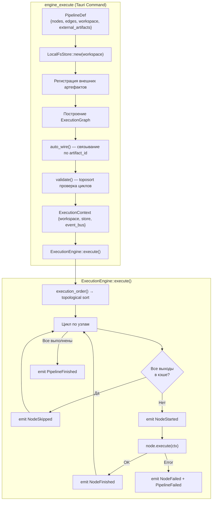

**Пояснение:**  
DAG Execution Engine — центральная подсистема, обеспечивающая детерминированное выполнение цепочки операций над артефактами (SBOM, отчёты, исходный код). Процесс выполнения состоит из двух фаз:

**Фаза подготовки** (функция `engine_execute`):
1. Создание хранилища артефактов `LocalFsStore` в рабочей директории `workspace/artifacts/`.
2. Регистрация внешних артефактов (например, директория с исходным кодом, которая уже существует на диске) — каждый получает `ArtifactRef` с типизированным `ArtifactKind`.
3. Построение графа: для каждого узла из определения `PipelineDef` вызывается `build_node()`, который создаёт конкретную реализацию `ExecutableNode` на основе `node_type` (validate, merge, cdxgen_scan и т.д.).
4. **Auto-wiring** — автоматическое связывание узлов: `auto_wire()` проходит по всем узлам, находит продюсеров для каждого `input.id` и создаёт рёбра графа. При этом проверяется совместимость типов (например, `ValidatedSBOM` может использоваться как `SBOM`).
5. Валидация: `validate()` запускает `toposort()` из библиотеки `petgraph` — если граф содержит цикл, возвращается ошибка `CycleDetected`.

**Фаза выполнения** (`ExecutionEngine::execute`):
1. Получение порядка выполнения через топологическую сортировку.
2. Последовательный обход узлов. Для каждого узла:
   - **Проверка кэша**: если все выходные артефакты уже существуют в `ArtifactStore`, узел пропускается с событием `NodeSkipped`. Это обеспечивает инкрементальность — повторный запуск не переделывает уже готовые шаги.
   - **Выполнение**: если кэш не полный, вызывается `node.execute(ctx)`, который запускает внешнюю команду (cyclonedx CLI, cdxgen и т.д.), читает ввод из хранилища и записывает результат обратно.
3. На каждом шаге генерируются события через `EventBus`, обеспечивая real-time обновление UI.
4. При ошибке выполнение немедленно прекращается с `PipelineFailed`.

---

## 5. Типы узлов (ExecutableNode implementations)

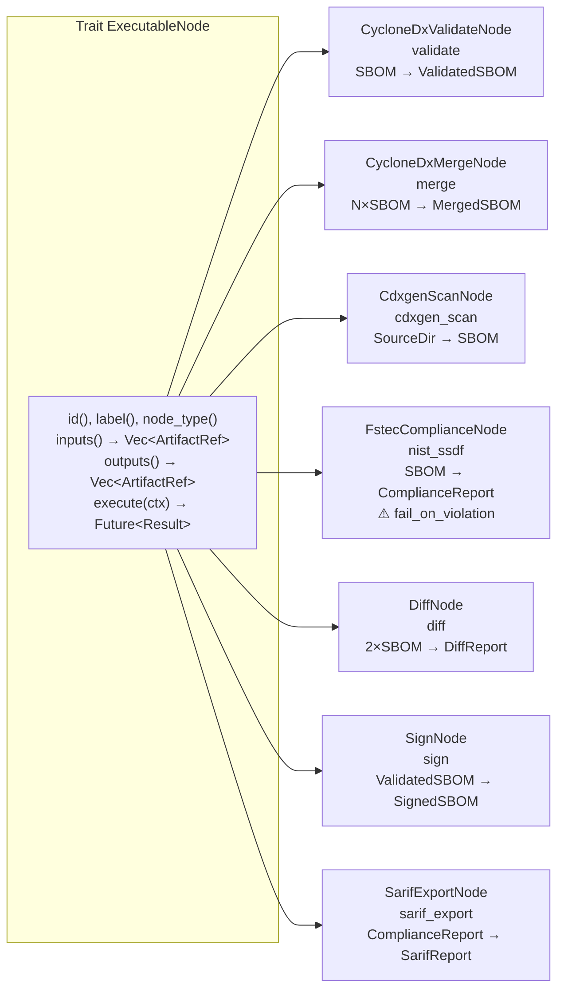

**Пояснение:**  
Все узлы DAG реализуют trait `ExecutableNode`, определяющий унифицированный контракт:

- `id()` — уникальный идентификатор узла в графе (задаётся пользователем при создании пайплайна).
- `label()` — человеко-читаемое название для отображения в UI.
- `node_type()` — строковый тип для сериализации/десериализации ("validate", "merge" и т.д.).
- `inputs()` / `outputs()` — списки типизированных ссылок на артефакты (`ArtifactRef`), определяющие, что узел потребляет и что производит.
- `execute(ctx)` — асинхронная функция выполнения, принимающая `ExecutionContext` с доступом к хранилищу и шине событий.

**7 конкретных реализаций:**

| Узел | Тип | Вход → Выход | Описание |
|------|-----|-------------|----------|
| `CycloneDxValidateNode` | validate | SBOM → ValidatedSBOM | Проверяет BOM на соответствие CycloneDX JSON Schema |
| `CycloneDxMergeNode` | merge | N×SBOM → MergedSBOM | Объединяет несколько BOM в один |
| `CdxgenScanNode` | cdxgen_scan | SourceDir → SBOM | Сканирует исходный код и генерирует SBOM |
| `FstecComplianceNode` | nist_ssdf | SBOM → ComplianceReport | 4 проверки NIST. **Новое**: `fail_on_violation` — блокировка или предупреждение |
| `DiffNode` | diff | 2×SBOM → DiffReport | Сравнивает два BOM |
| `SignNode` | sign | ValidatedSBOM → SignedSBOM | Заглушка для подписи BOM |
| `SarifExportNode` | sarif_export | ComplianceReport → SarifReport | **Новый!** Конвертирует NIST-отчёт в SARIF 2.1.0 |

---

## 6. Система типов артефактов

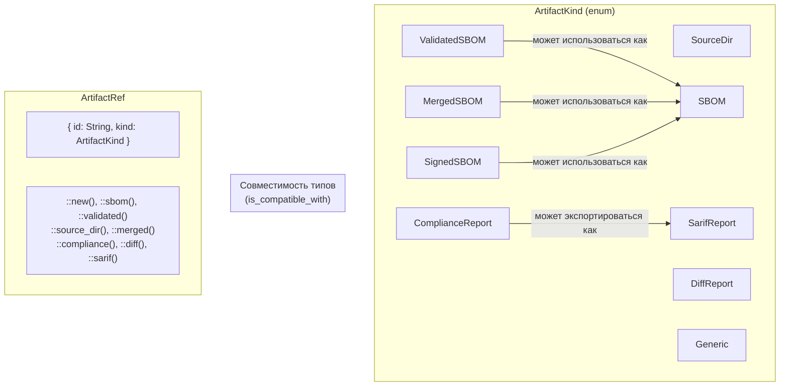

**Пояснение:**  
Система типов артефактов обеспечивает **типобезопасность** при передаче данных между узлами DAG:

- **`ArtifactKind`** — перечисление (enum) из **9 категорий**: `SourceDir`, `SBOM`, `ValidatedSBOM`, `MergedSBOM`, `SignedSBOM`, `ComplianceReport`, `DiffReport`, `SarifReport` (новый!), `Generic`.

- **Правила совместимости**: `ValidatedSBOM`, `MergedSBOM`, `SignedSBOM` совместимы с `SBOM`. **Новое**: `ComplianceReport` совместим с `SarifReport` (позволяет автоматически связывать NIST-узел с SarifExportNode).

- **`ArtifactRef`** — именованная ссылка на артефакт, состоящая из `id` (строковый идентификатор, уникальный в рамках пайплайна) и `kind` (тип). Фабричные методы (`::sbom()`, `::validated()`, `::source_dir()` и т.д.) упрощают создание ссылок. При `auto_wire()` движок связывает узлы по совпадению `id`: если один узел производит артефакт с `id = "validated.sbom"`, а другой потребляет вход с таким же `id`, ребро графа создаётся автоматически.

---

## 7. Хранилища артефактов (ArtifactStore)

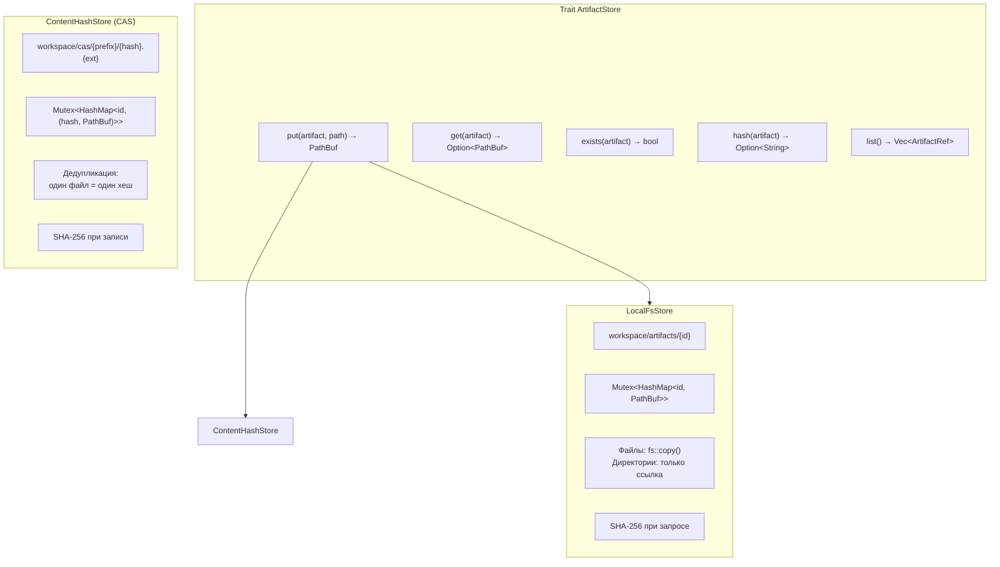

**Пояснение:**  
Хранилище артефактов абстрагировано через trait `ArtifactStore` с 5 методами: `put` (сохранение), `get` (получение пути), `exists` (проверка наличия), `hash` (SHA-256 хеш содержимого), `list` (перечисление).

Реализованы **две стратегии хранения**:

1. **`LocalFsStore`** — простое хранилище в файловой системе. Артефакты сохраняются в `workspace/artifacts/{id}`. Файлы копируются через `fs::copy()`, а директории (например, для `SourceDir`) только регистрируются в индексе без копирования. Индекс (`HashMap<id, PathBuf>`) хранится в памяти и защищён `Mutex`. Хеширование SHA-256 выполняется **при запросе** (lazy). Это основное хранилище, используемое по умолчанию.

2. **`ContentHashStore` (CAS)** — контентно-адресуемое хранилище. При `put()` файл читается, вычисляется SHA-256, и сохраняется по пути `workspace/cas/{первые 2 символа хеша}/{полный хеш}.{расширение}`. Если файл с таким хешем уже существует — запись пропускается (дедупликация). Индекс хранит маппинг `id → (hash, path)`. Хеш доступен **мгновенно** (вычислен при записи). Это экспериментальное хранилище для будущего использования.

Обе реализации потокобезопасны (`Send + Sync`) благодаря `Mutex` на индексе и используют `Arc` для разделения между узлами графа.

---

## 8. Система событий (EventBus)

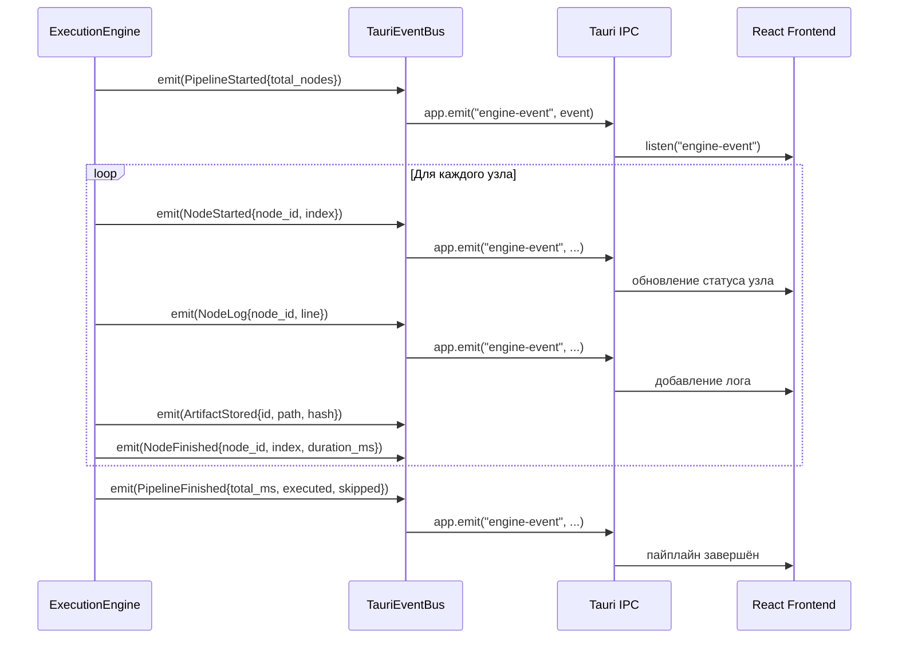

### Все 9 типов EngineEvent:

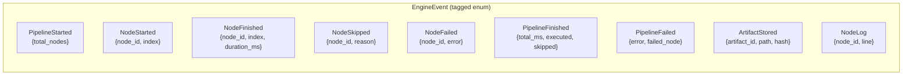

**Пояснение:**  
Система событий обеспечивает **real-time обратную связь** между DAG-двигателем и пользовательским интерфейсом. Архитектура трёхуровневая:

1. **`EventBus` (trait)** — абстракция шины событий с единственным методом `emit(EngineEvent)`. Это позволяет подменять реализацию: `TauriEventBus` для продакшена (транслирует события через Tauri IPC), `NoopEventBus` для тестов (игнорирует все события).

2. **`TauriEventBus`** — конкретная реализация, которая оборачивает `tauri::AppHandle` и вызывает `app.emit("engine-event", &event)` для каждого события. На фронтенде компонент `DagPipelineBuilder` подписывается через `listen("engine-event")` и обновляет статусы узлов, логи и прогресс в реальном времени.

3. **9 типов `EngineEvent`** (tagged enum с `#[serde(tag = "type", content = "payload")]`):
   - Жизненный цикл пайплайна: `PipelineStarted`, `PipelineFinished`, `PipelineFailed`
   - Жизненный цикл узла: `NodeStarted`, `NodeFinished`, `NodeSkipped`, `NodeFailed`
   - Данные: `ArtifactStored` (с SHA-256 хешем), `NodeLog` (строка лога от узла)

События сериализуются в JSON и передаются через IPC-канал Tauri. Фронтенд десериализует payload и обновляет состояние компонента `DagPipelineBuilder` — статусы узлов, длительность выполнения, логи и ошибки.

---

## 9. SQLite — Схема базы данных

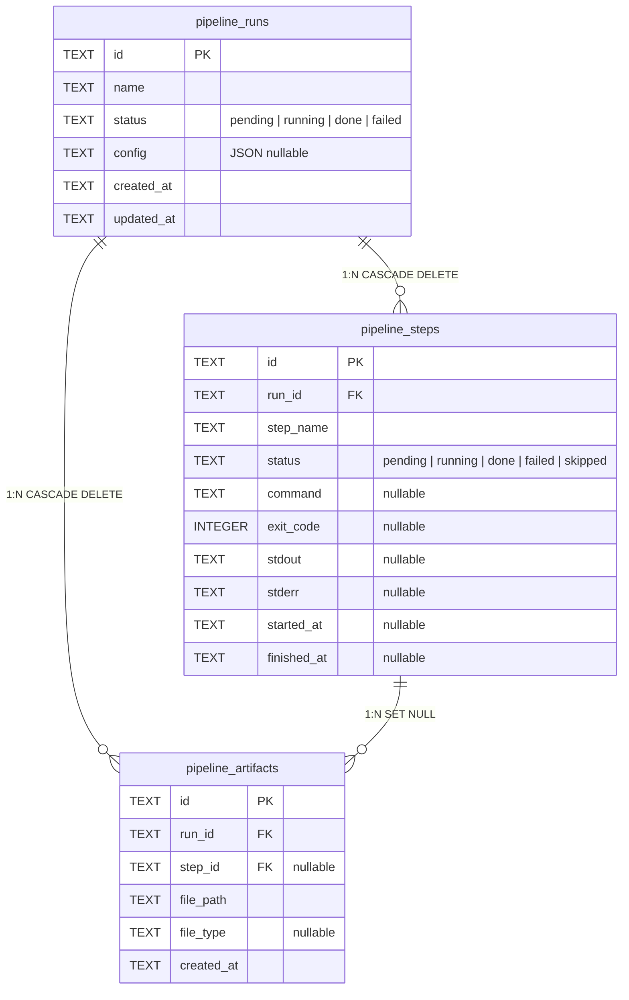

**Пояснение:**  
База данных SQLite используется для **персистентного хранения истории** запусков пайплайнов. Схема состоит из 3 таблиц:

- **`pipeline_runs`** — основная таблица запусков. Каждый запуск имеет уникальный UUID, имя, статус (`pending → running → done/failed`), опциональный JSON-конфиг и метки времени. Статус вычисляется автоматически: если все шаги завершены — `done`, если хотя бы один провалился — `failed`, иначе — `running`.

- **`pipeline_steps`** — шаги внутри запуска. Каждый шаг привязан к `run_id` (каскадное удаление). Хранит имя шага, статус, команду, код выхода, stdout/stderr, и временные метки начала/окончания. Статус шага может принимать 5 значений: `pending`, `running`, `done`, `failed`, `skipped`.

- **`pipeline_artifacts`** — артефакты, произведённые шагами. Привязаны к `run_id` (CASCADE DELETE) и опционально к `step_id` (SET NULL при удалении шага). Хранят путь к файлу и тип.

Работа с БД через `rusqlite` (bundled SQLite). Режим WAL включен для лучшей конкурентности. Все операции синхронные (`Mutex<Connection>`), что безопасно при однопоточном доступе из Tauri-команд.

---

## 10. Frontend — компонентная архитектура

```mermaid
graph TB
    subgraph "React Entry"
        main["main.tsx<br/>ReactDOM.createRoot"]
        app["App.tsx<br/>imports AppLayout + CSS"]
    end

    subgraph "AppLayout.tsx — корневой компонент"
        TabBar["Nav Tabs — 30 табов"]
        TabContent["Tab Content — условный рендеринг"]
        Overlays["Overlays: Settings + History"]
        State["State: activeTab, settingsOpen, historyOpen, history[]"]
    end

    subgraph "Группа: Основные инструменты"
        Runner["CycloneDXRunner<br/>CLI интерфейс"]
        Wizard["WizardPanel<br/>Пошаговый мастер"]
        Fstec["FstecWizard<br/>NIST проверка"]
        DagEngine["DagPipelineBuilder<br/>Визуальный DAG"]
    end

    subgraph "Группа: Просмотр и анализ"
        JsonV["JsonViewer"]
        VulnD["VulnDashboard"]
        DiffV["DiffViewer"]
        AnalyzeD["AnalyzeDashboard"]
        DepG["DependencyGraph"]
        HealthS["BomHealthScore"]
    end

    subgraph "Группа: Операции с BOM"
        Merge["MergeVisualizer"]
        Convert["SmartConvert"]
        Compare["BomCompare"]
        AddFiles["AddFilesPanel"]
        BomGen["BomGeneratorWizard"]
    end

    subgraph "Группа: Безопасность и комплаенс"
        CryptoP["CryptoPanel"]
        CbomV["CbomViewer"]
        AttestD["AttestationDashboard"]
        VexV["VexViewer"]
        EvidP["EvidencePanel"]
        BuildP["BuildProvenance"]
    end

    subgraph "Группа: Метаданные"
        LicI["LicenseIntelligence"]
        ServP["ServicesPanel"]
        ReportG["ReportGenerator"]
        StandV["StandardsViewer"]
        TestS["TestScopeViewer"]
        ExtRefs["ExternalRefsExplorer"]
        PurlA["PurlAnalyzer"]
        SupplI["SupplierIntelligence"]
    end

    subgraph "Группа: Утилиты"
        Settings["SettingsPanel"]
        HistoryD["HistoryDrawer"]
        Toasts["ToastProvider"]
        DropZ["DropZone"]
        StreamO["StreamOutput"]
        PipeH["PipelineHistory"]
    end

    main --> app --> AppLayout
    AppLayout --> TabBar
    AppLayout --> TabContent
    AppLayout --> Overlays
    TabContent --> Runner & Wizard & Fstec & DagEngine
    TabContent --> JsonV & VulnD & DiffV & AnalyzeD & DepG & HealthS
    TabContent --> Merge & Convert & Compare & AddFiles & BomGen
    TabContent --> CryptoP & CbomV & AttestD & VexV & EvidP & BuildP
    TabContent --> LicI & ServP & ReportG & StandV & TestS & ExtRefs & PurlA & SupplI
    TabContent --> PipeH
    Overlays --> Settings & HistoryD
    AppLayout --> Toasts
```

**Пояснение:**  
Фронтенд построен по принципу **«один таб = один компонент»**. Корневой `AppLayout.tsx` управляет навигацией:

- **Состояние** хранит: `activeTab` (текущий таб), `settingsOpen`/`historyOpen` (оверлеи), `history[]` (до 100 последних команд).
- **Табы** (30 шт.) определены в массиве `TABS` с иконками и метками. Активный таб рендерится через условный `{activeTab === "xxx" && <Component />}` — ленивый рендеринг, только один компонент в DOM единовременно.
- **Группировка компонентов** по функциональным областям:
  - **Основные инструменты**: CLI Runner (прямое выполнение команд), Wizard (пошаговый мастер), NIST (комплаенс), DAG Engine (визуальный конструктор пайплайнов).
  - **Просмотр и анализ**: JSON Viewer, Vulnerability Dashboard, Diff Viewer, Dependency Graph, BOM Health Score.
  - **Операции с BOM**: Merge, Convert (JSON↔XML), Compare, Add Files, BOM Generator.
  - **Безопасность**: Crypto Panel (криптография в BOM), CBOM, Attestation, VEX, Evidence, Build Provenance.
  - **Метаданные**: Licenses, Services, Reports, Standards, Test Scope, External Refs, PURL, Supplier Intelligence.
  - **Утилиты**: Settings (оверлей), History Drawer (оверлей), Toast уведомления, DropZone (drag & drop), StreamOutput (потоковый вывод), Pipeline History.

Компонент `ToastProvider` оборачивает всё приложение и предоставляет контекст для всплывающих уведомлений.

---

## 11. IPC-мост: Frontend ↔ Backend

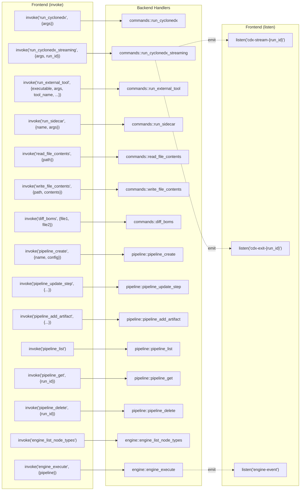

**Пояснение:**  
IPC-мост обеспечивает полноценную двустороннюю коммуникацию:

**Команды (invoke)** — 15 функций, сгруппированных по назначению:
- **Запуск CLI**: 4 команды для различных способов вызова внешних инструментов — от sidecar до произвольных бинарников из PATH. `run_cyclonedx` — синхронное выполнение, `run_cyclonedx_streaming` — потоковое с событиями, `run_external_tool` — универсальный раннер с поддержкой рабочей директории и переменных окружения, `run_sidecar` — обобщённый sidecar.
- **Файловые операции**: чтение (`read_file_contents`) и запись (`write_file_contents`) через tokio async I/O.
- **Сравнение BOM**: `diff_boms` — вызов `cyclonedx diff` через sidecar.
- **Pipeline CRUD**: 6 команд для работы с историей пайплайнов в SQLite.
- **Engine**: 2 команды — получение описания доступных типов узлов (`engine_list_node_types`, возвращает `NodeDescriptor[]` с иконками, типами входов/выходов и описаниями) и выполнение DAG-пайплайна (`engine_execute`).

**События (listen)** — 3 канала:
- `cdx-stream-{run_id}` — построчный вывод stdout/stderr от streaming-запуска CLI. Пунктирные стрелки на диаграмме показывают, что это асинхронные emit-события.
- `cdx-exit-{run_id}` — код завершения процесса.
- `engine-event` — события DAG-двигателя (все 9 типов EngineEvent).

---

## 12. Граф выполнения DAG — пример пайплайна

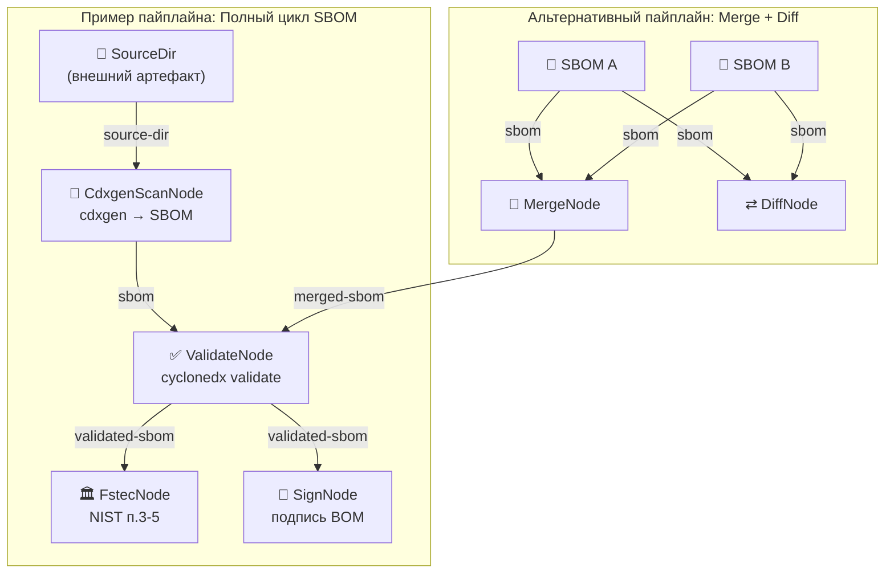

**Пояснение:**  
Диаграмма показывает два примера реальных пайплайнов:

**Полный цикл SBOM** — линейная цепочка с ветвлением:
1. `SourceDir` (внешний артефакт — директория с кодом) подаётся на вход `CdxgenScanNode`, который генерирует SBOM.
2. SBOM проходит валидацию через `ValidateNode` (вызов `cyclonedx validate`).
3. Валидированный SBOM (тип `ValidatedSBOM`, совместим с `SBOM`) разветвляется:
   - `FstecNode` — проверка на соответствие требованиям NIST (пп. 3-5).
   - `SignNode` — подпись BOM (пока заглушка).

Эти узлы выполняются в правильном порядке благодаря топологической сортировке: сначала scan, потом validate, затем параллельно nist_ssdf и sign.

**Merge + Diff** — пайплайн с множественными входами:
- Два BOM (`SBOM A` и `SBOM B`) подаются на `MergeNode` (слияние в один BOM) и `DiffNode` (сравнение).
- Результат merge (`MergedSBOM`) совместим с типом `SBOM`, поэтому может быть передан на `ValidateNode`.

Все связи устанавливаются автоматически через `auto_wire()` по совпадению `artifact_id`.

---

## 13. Зависимости (Cargo.toml)

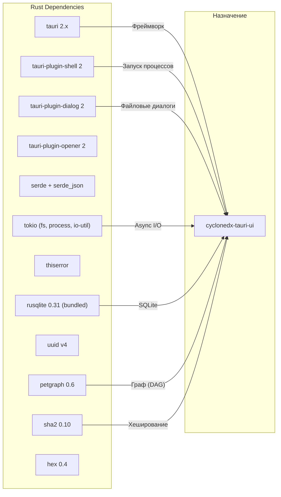

**Пояснение:**  
Rust-бэкенд использует 12 crate-зависимостей, каждая с чётким назначением:

- **tauri 2.x** + 3 плагина — основа десктоп-приложения: IPC, управление окнами, подписка на события.
- **serde + serde_json** — сериализация/десериализация всех данных между Rust и JavaScript (JSON автоматически для Tauri Commands).
- **tokio** (features: fs, process, io-util) — async runtime для неблокирующих файловых операций и запуска дочерних процессов.
- **rusqlite 0.31 (bundled)** — SQLite с включённой библиотекой, не требует системной установки SQLite. Поддержка WAL mode.
- **petgraph 0.6** — библиотека для работы с направленными графами: `DiGraph`, `toposort()`, `NodeIndex`. Основа DAG Engine.
- **sha2 0.10 + hex 0.4** — вычисление SHA-256 хешей артефактов для кэширования и верификации.
- **uuid v4** — генерация уникальных идентификаторов для pipeline_runs, steps, artifacts.
- **thiserror** — деривация `Error` trait для типобезопасных enum-ошибок (`CycloneError`, `ExecutionError`).

---

## 14. Frontend зависимости (package.json)

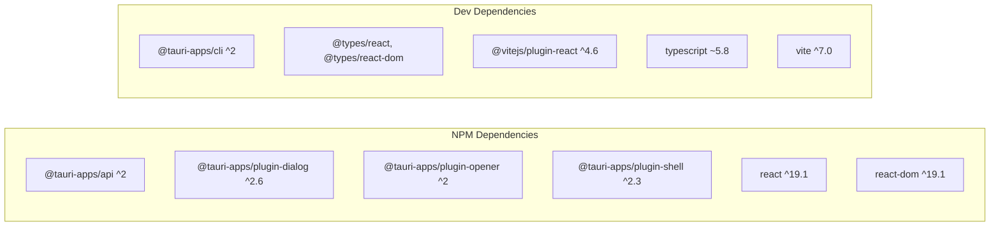

**Пояснение:**  
Фронтенд использует минимальный набор зависимостей:

- **Runtime**: `react ^19.1` и `react-dom ^19.1` — последняя мажорная версия React с конкурентным рендерингом.
- **Tauri API**: `@tauri-apps/api ^2` — базовый пакет для `invoke()` и `listen()`. Три плагина: `plugin-dialog` (нативные диалоги выбора файлов, используется для загрузки BOM), `plugin-opener` (открытие URL), `plugin-shell` (доступ к sidecar из JS, хотя основные вызовы идут через Rust).
- **Сборка**: `vite ^7.0` с `@vitejs/plugin-react ^4.6` (SWC-based Fast Refresh), `typescript ~5.8` (строгий режим типизации).

Проект **не использует** сторонних UI-библиотек — все стили описаны в единственном `App.css` (~3000 строк). Нет роутера — навигация через табы с `useState`.

---

## 15. Потоки данных — Streaming CLI

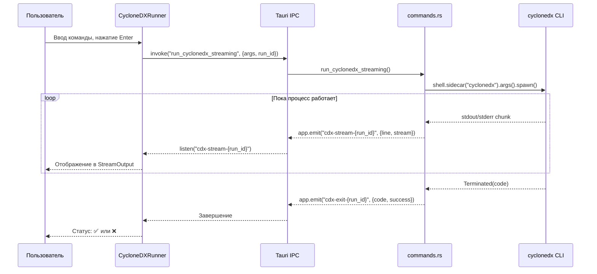

**Пояснение:**  
Streaming CLI — механизм потокового вывода результатов длительных команд. В отличие от `run_cyclonedx` (синхронный, возвращает один `ExecResult`), `run_cyclonedx_streaming` работает через события:

1. Фронтенд вызывает `invoke()` с уникальным `run_id` и сразу подписывается на два канала событий.
2. Бэкенд создаёт sidecar-процесс через `shell.sidecar().spawn()` (а не `.output()`) — это даёт доступ к `rx` (receiver канала событий процесса).
3. В цикле `while let Some(event) = rx.recv().await` перехватываются четыре типа событий: `Stdout`, `Stderr`, `Terminated`, `Error`.
4. Каждая строка stdout/stderr немедленно отправляется на фронтенд через `app.emit("cdx-stream-{run_id}", StreamEvent{...})`.
5. Компонент `StreamOutput` в UI получает события через `listen()` и добавляет строки в буфер отображения, создавая эффект терминала.
6. При завершении процесса отправляется `ExitEvent` с кодом возврата.

Этот механизм критически важен для длительных операций (scan проекта через cdxgen, merge больших BOM), когда пользователь должен видеть прогресс в реальном времени.

---

## 16. Keyboard Shortcuts

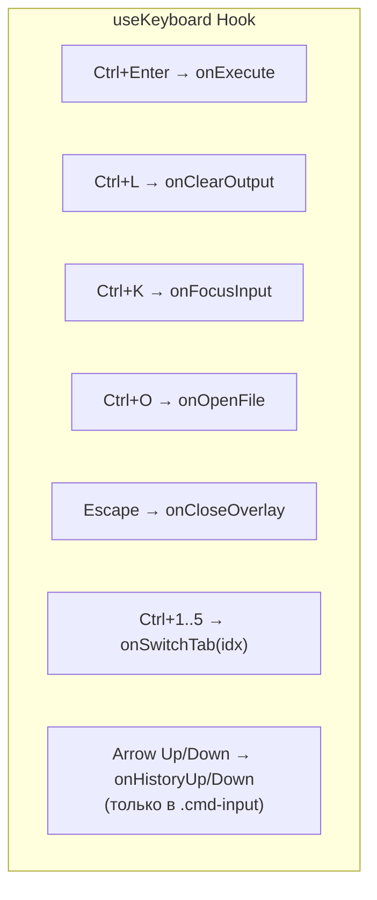

**Пояснение:**  
Хук `useKeyboard` реализует глобальную обработку клавиатурных сочетаний через `window.addEventListener("keydown")`. Обработчик мемоизирован через `useCallback` и очищается при размонтировании.

**Сочетания:**
- **Ctrl+Enter** — запуск текущей команды (используется в CycloneDXRunner).
- **Ctrl+L** — очистка вывода терминала.
- **Ctrl+K** — фокус на поле ввода команды.
- **Ctrl+O** — открытие файлового диалога для выбора BOM.
- **Escape** — закрытие текущего оверлея (Settings или History).
- **Ctrl+1..5** — быстрое переключение между первыми 5 табами.
- **Arrow Up/Down** — навигация по истории команд, работает только когда фокус на элементе `.cmd-input`.

Хук принимает объект `KeyboardShortcuts` с опциональными колбэками — потребитель сам решает, какие сочетания обрабатывать.

---

## 17. Сводная таблица компонентов

| # | Компонент | Таб | Назначение |
|---|-----------|-----|------------|
| 1 | `CycloneDXRunner` | runner | CLI интерфейс запуска cyclonedx |
| 2 | `WizardPanel` | wizard | Пошаговый мастер команд |
| 3 | `FstecWizard` | nist_ssdf | Проверка на соответствие NIST |
| 4 | `PipelineHistory` | runs | История запусков пайплайнов |
| 5 | `CryptoPanel` | crypto | Просмотр крипто-данных BOM |
| 6 | `AnalyzeDashboard` | analyze | Аналитика BOM |
| 7 | `AddFilesPanel` | addfiles | Добавление файлов в BOM |
| 8 | `SmartConvert` | convert | Конвертация JSON↔XML |
| 9 | `MergeVisualizer` | merge | Визуальное слияние BOM |
| 10 | `DependencyGraph` | depgraph | Граф зависимостей |
| 11 | `LicenseIntelligence` | licenses | Анализ лицензий |
| 12 | `CbomViewer` | cbom | Crypto BOM |
| 13 | `AttestationDashboard` | attestation | Аттестации |
| 14 | `ServicesPanel` | services | Сервисы BOM |
| 15 | `BuildProvenance` | build | Провенанс сборки |
| 16 | `EvidencePanel` | evidence | Свидетельства |
| 17 | `BomHealthScore` | health | Оценка качества BOM |
| 18 | `BomCompare` | compare | Сравнение BOM |
| 19 | `VexViewer` | vex | VEX записи |
| 20 | `ReportGenerator` | report | Генерация отчётов |
| 21 | `StandardsViewer` | standards | Стандарты |
| 22 | `BomGeneratorWizard` | bomgen | Генератор BOM |
| 23 | `TestScopeViewer` | testscope | Тестовый скоуп |
| 24 | `ExternalRefsExplorer` | extrefs | Внешние ссылки |
| 25 | `PurlAnalyzer` | purl | Анализ PURL |
| 26 | `SupplierIntelligence` | supplier | Анализ поставщиков |
| 27 | `DagPipelineBuilder` | dagengine | Визуальный DAG-конструктор |
| 28 | `JsonViewer` | json | Просмотр JSON |
| 29 | `VulnDashboard` | vuln | Уязвимости |
| 30 | `DiffViewer` | diff | Визуальный diff |
| — | `SettingsPanel` | overlay | Настройки |
| — | `HistoryDrawer` | overlay | История команд |
| — | `DropZone` | sub | Drag & drop зона |
| — | `StreamOutput` | sub | Потоковый вывод CLI |
| — | `Toasts` | global | Уведомления |

**Пояснение:**  
Таблица показывает все 36 компонентов с их табами и назначением. Ключевые наблюдения:

- **30 табированных компонентов** — каждый рендерится в отдельном табе `AppLayout`. Компоненты полностью изолированы друг от друга, обмен данными происходит только через Tauri backend (invoke → Rust → файловая система).
- **3 оверлейных компонента** (`SettingsPanel`, `HistoryDrawer`, `Toasts`) — отображаются поверх основного контента.
- **3 вспомогательных компонента** (`DropZone`, `StreamOutput`, `PipelineHistory`) — встраиваются внутрь других компонентов.
- Компоненты ранжированы по размеру: от `FstecWizard` (~31 КБ, самый сложный) до `DropZone` (~2 КБ, самый простой).

---

## 18. Обработка ошибок

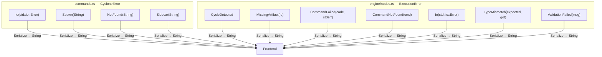

**Пояснение:**  
Обработка ошибок разделена на два домена:

**`CycloneError`** (в `commands.rs`) — ошибки уровня команд:
- `Io` — ошибки ввода/вывода (файл не найден, отказано в доступе и т.д.).
- `Spawn` — не удалось запустить процесс (нехватка ресурсов, ошибки ОС).
- `NotFound` — исполняемый файл не найден в PATH (например, `cdxgen` не установлен).
- `Sidecar` — ошибка запуска sidecar-бинарника (конфигурация Tauri, подпись, или отсутствие файла в `binaries/`).

**`ExecutionError`** (в `engine/nodes.rs`) — ошибки уровня DAG Engine:
- `CycleDetected` — обнаружен цикл в графе при `toposort()` (невозможно определить порядок выполнения).
- `MissingArtifact(id)` — требуемый артефакт не найден в хранилище (ни один узел не произвёл его).
- `CommandFailed(code, stderr)` — внешняя команда завершилась с ненулевым кодом выхода.
- `CommandNotFound(cmd)` — исполняемый файл не найден (аналог `NotFound`, но на уровне Engine).
- `TypeMismatch{expected, got}` — несовместимость типов артефактов при auto-wiring.
- `ValidationFailed(msg)` — произвольная ошибка валидации графа.

Обе ошибки реализуют `Serialize` (через `serialize_str(&self.to_string())`), что позволяет Tauri транслировать их во фронтенд как строковые сообщения. На фронтенде ошибки отображаются в UI как строки.

---

## 19. Полная карта связей (C4 Level 2)

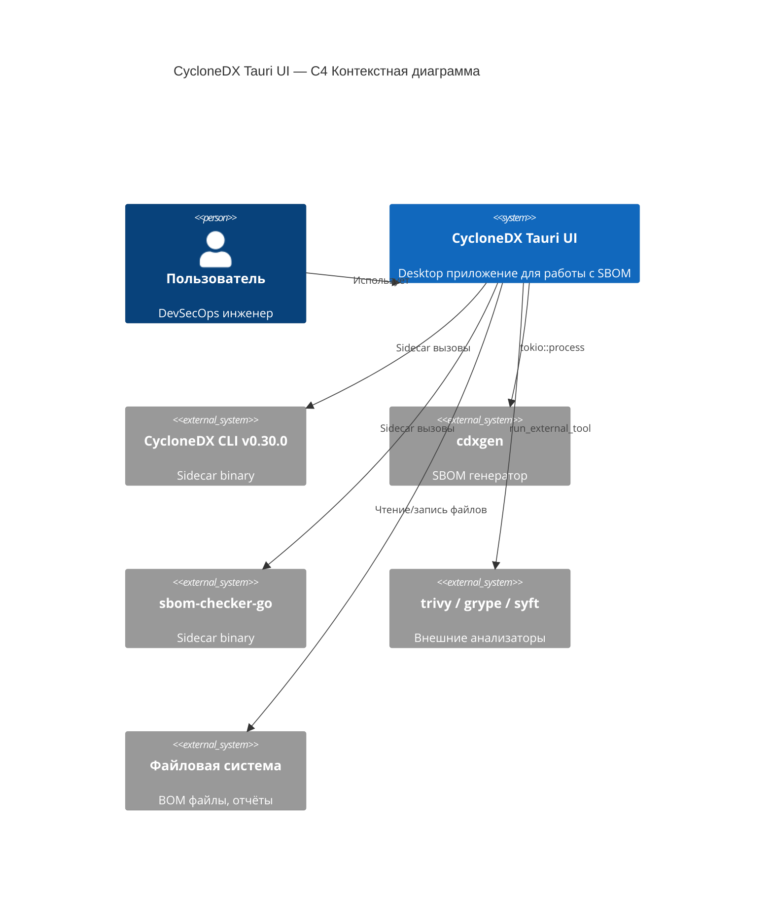

**Пояснение:**  
C4-диаграмма контекстного уровня показывает **внешние границы** системы и её взаимодействие с окружением:

- **Пользователь** (`DevSecOps инженер`) — оператор, работающий с интерфейсом приложения: загружает BOM, запускает анализ, строит пайплайны.
- **CycloneDX Tauri UI** — центральная система, объединяющая все возможности.
- **Внешние системы**:
  - `CycloneDX CLI v0.30.0` — sidecar-бинарник, упакованный в бандл приложения. Вызывается для validate, merge, diff, sign, convert и других операций.
  - `cdxgen` — внешняя утилита, вызываемая через `tokio::process::Command`. Генерирует SBOM из исходного кода проекта.
  - `sbom-checker-go` — sidecar-бинарник для дополнительных проверок.
  - `trivy / grype / syft` — произвольные анализаторы уязвимостей, вызываемые через `run_external_tool` (любой бинарник из PATH).
  - `Файловая система` — хранение BOM-файлов, артефактов пайплайна, отчётов и SQLite базы данных.

Все внешние инструменты вызываются **из Rust-бэкенда** — фронтенд никогда не запускает процессы напрямую.

---

## 16. Фазы 9–15: Agentic DevSecOps Layer + Hyperscale

> **Версия**: 0.6.0 (Phase 9–15)
> **Дата**: 2026-03-11

Начиная с Фазы 9, проект трансформировался из инструмента SBOM-анализа в **Autonomous Graph-Driven DevSecOps Engine** — полноценную AI-платформу с автономным роем из 7 агентов.

### 16.1 Архитектура Multi-Agent Swarm (7 агентов)

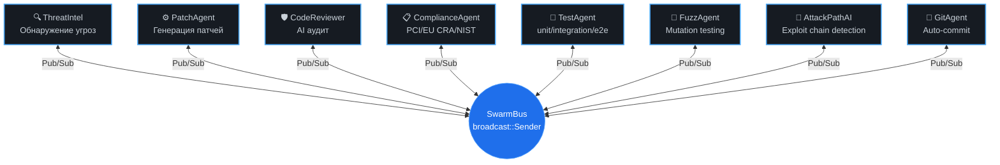

**SwarmEvent enum** (9 вариантов):
- `ThreatDetected { node_id, vuln_id, description }`
- `ReviewRequested { node_id, vuln_id, original_code, proposed_patch }`
- `ReviewResult { node_id, vuln_id, approved, feedback, proposed_patch }`
- `PatchApplied { node_id, vuln_id, file_path, commit_id }`
- `ComplianceResult { node_id, vuln_id, passed, score, details }`
- `RollbackPerformed { node_id, vuln_id, commit_id, reason }`
- `TestPassed { node_id, vuln_id, test_type, passed, details }` ← **Phase 15**
- `FuzzResult { node_id, vuln_id, mutations, crashes, coverage_pct }` ← **Phase 15**
- `ExploitChainDetected { chain_id, stages[], severity, entry_point, target }` ← **Phase 15**

### 16.2 Все Tauri-команды (Фазы 9–15)

| Команда | Описание |
|---------|----------|
| `trigger_swarm_demo` | Запуск 7-агентного Swarm |
| `replay_demo` | Полный каскад: 3 CVE + Test + Fuzz + Exploit Chain |
| `scan_real_cves` | `cargo audit --json` |
| `generate_sbom` | CycloneDX 1.5 JSON |
| `chat_with_nova` | Диалог с Nova AI (Bedrock) |
| `generate_cicd_pipeline` | GitHub Actions YAML |
| `generate_security_readme` | SECURITY.md с CVE-таблицей |
| `send_notification` | Emit desktop-notification |

### 16.3 Все React-компоненты (Phase 9–15)

| Компонент | Файл | Описание |
|-----------|------|----------|
| PitchDashboard | `PitchDashboard.tsx` | Live-телеметрия, Neural Graph, Voice |
| SwarmActivity | `SwarmActivityModule.tsx` | Event cards + инлайн Git Diff |
| AgentNeuralGraph | `AgentNeuralGraph.tsx` | Анимированная SVG нейросеть |
| SecurityToolsPanel | `SecurityToolsPanel.tsx` | 7 табов: Score, Chat, SBOM, CI/CD, Heatmap, README, Alerts |
| PitchSlides | `PitchSlides.tsx` | 6 слайдов, fullscreen (F) |
| AdvancedPanel | `AdvancedFeaturesPanel.tsx` | 5 табов: Profiler, Multi-Lang, Timeline, Achievements, Demo |
| CommandPalette | `CommandPalette.tsx` | Ctrl+K, 16+ команд |
| DependencyTree | `DependencyTreePanel.tsx` | Интерактивное дерево Cargo |
| ExecutiveSummary | `ExecutiveSummary.tsx` | Отчёт для CTO |
| **AttackPathEngine** | `AttackPathEngine.tsx` | **5 табов: Exploit Chains, Temporal Graph, Test Agent, Fuzz Agent, Event Store** |

### 16.4 Sidebar NOVA SHIELD (12 вкладок)

```
🚀 Agentic Dashboard     — Live-счётчики, Neural Graph, Voice
🐝 Swarm Activity        — Event cards, Git Diff Viewer
🔴 Attack Graph Paths    — Граф атак (petgraph + Dijkstra)
🧬 Pulse Explorer        — React Flow актор-коммуникация
🔧 Security Tools        — 7 табов (Score/Chat/SBOM/CI-CD/Heatmap/README/Alerts)
🎬 Pitch Slides          — 6-slide deck, fullscreen
🎯 Advanced              — 5 табов (Profiler/Multi-Lang/Timeline/Achievements/Demo)
🌳 Dependency Tree       — Интерактивное дерево 25+ зависимостей
📱 Executive Report      — Одностраничный CTO-отчёт
🔎 Attack-Path AI        — 5 табов (Chains/Temporal/Test/Fuzz/EventStore)
```

### 16.5 Конкурентный анализ

| Конкурент | Datalog | Self-Healing | Actor Runtime | Graph-Native | AI Swarm |
|-----------|---------|-------------|---------------|-------------|----------|
| **Nova Shield** | ✅ Crepe | ✅ Auto-patch | ✅ Erlang/OTP | ✅ MetaGraph | ✅ 7 agents |
| GitHub CodeQL | ✅ | ❌ | ❌ | ❌ | ❌ |
| Snyk | ❌ | ❌ | ❌ | ❌ | ❌ |
| Palo Alto Prisma | ❌ | ❌ | ❌ | ❌ | ❌ |
| Semgrep | ❌ | ❌ | ❌ | ❌ | ❌ |


