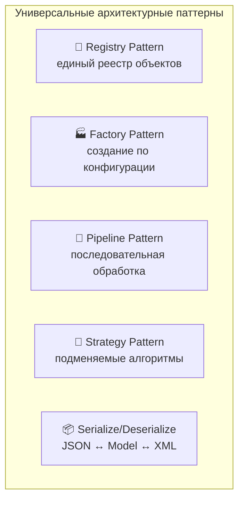
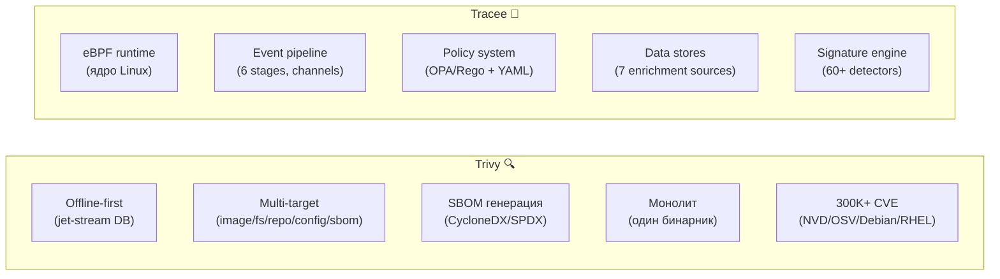
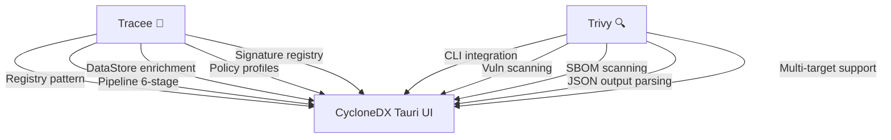
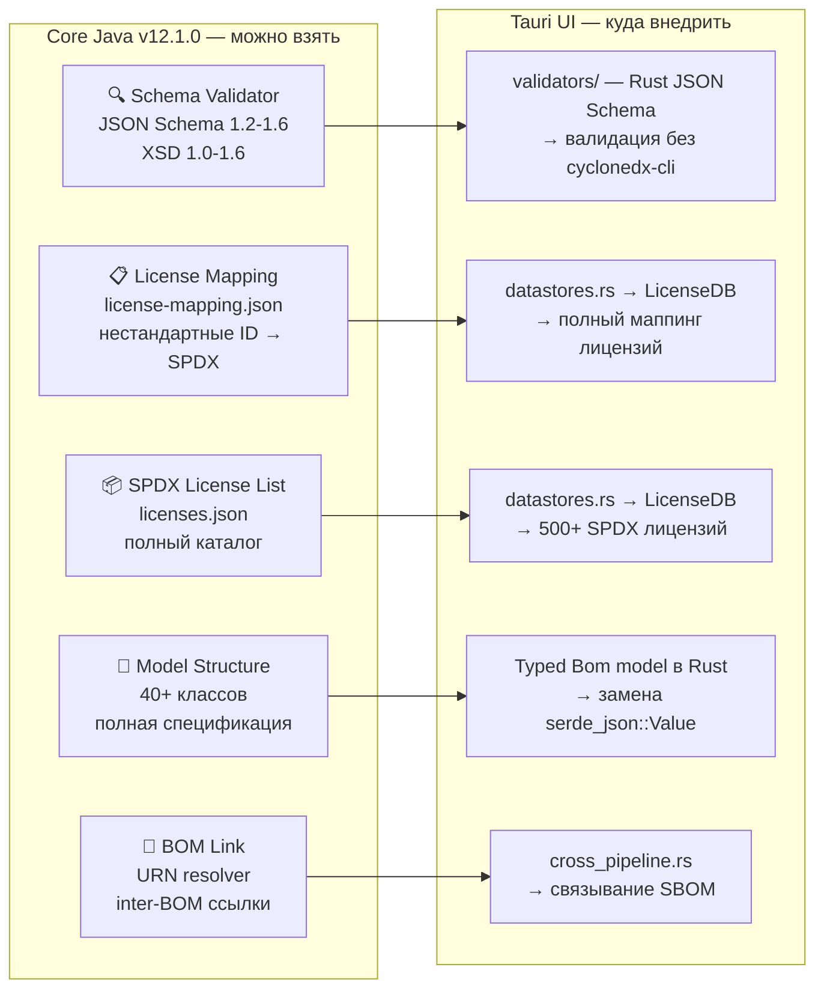
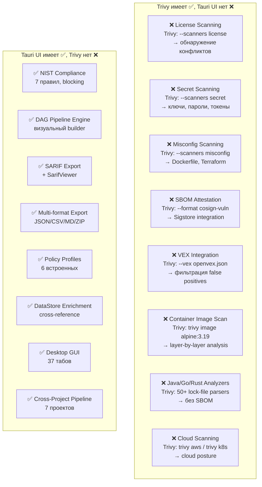
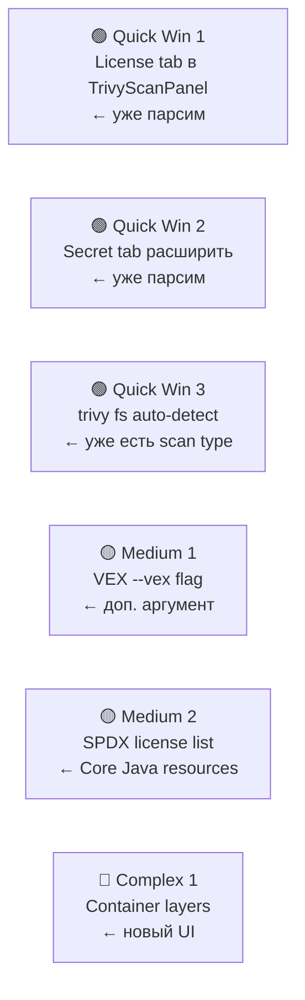
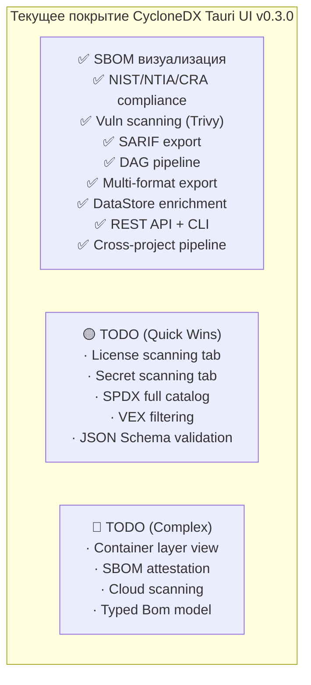

# Deep Comparative Analysis — 7 проектов CycloneDX Ecosystem

> **Дата**: 2026-03-05  
> **Автор**: AI Architecture Analyst  
> **Scope**: Black Duck, Core Java, CLI, Gradle Plugin, Tauri UI, Tracee, Trivy

---

## 1. Паттерны, повторяющиеся во всех проектах

**Пояснение:**  
5 архитектурных паттернов повторяются в разных комбинациях во всех 7 проектах. Это не случайность — они отражают фундаментальные потребности экосистемы безопасности ПО.

### 1.1 Registry Pattern

| Проект | Где используется | Что регистрируется |
|--------|-----------------|-------------------|
| **Tracee** | `pkg/detectors/registry.go` | 60+ сигнатур атак |
| **Tracee** | `pkg/datastores/registry.go` | 7 хранилищ данных |
| **Tauri UI** | `rules.rs` → RuleRegistry | 6 правил NIST/NTIA |
| **Tauri UI** | `datastores.rs` → DataSourceRegistry | 3 хранилища (Vuln, License, Supplier) |
| **Core Java** | `CycloneDxSchema` | 7 версий XSD + 7 JSON Schema |
| **Trivy** | `pkg/fanal/analyzer/` | 50+ анализаторов языков |
| **Trivy** | `pkg/detector/` | 4 детектора уязвимостей |

**Вывод**: Registry — самый распространённый паттерн. Он обеспечивает **расширяемость без изменения кода** (Open/Closed Principle). Tracee делает это лучше всех — через `init()` + auto-registration.

### 1.2 Factory Pattern

| Проект | Factory | Продукт |
|--------|---------|---------|
| **Core Java** | `BomGeneratorFactory` | JSON/XML генераторы |
| **Core Java** | `BomParserFactory` | JSON/XML парсеры |
| **CLI** | Command dispatch | 8 подкоманд (validate, convert, merge...) |
| **Gradle Plugin** | `CyclonedxPlugin.apply()` | Direct/Aggregate tasks |
| **Tauri UI** | `build_node()` | 6 типов DAG-узлов |
| **Trivy** | `ScannerFactory` | Image/FS/Repo/Config сканеры |
| **Tauri UI** | `ReportExporter` | JSON/SARIF/CSV/Markdown |

### 1.3 Pipeline Pattern

| Проект | Стадии | Характеристика |
|--------|--------|----------------|
| **Tracee** | 6 (decode→match→process→derive→detect→sink) | Безблокировочный, channel-based |
| **Trivy** | 3 (analyze→detect→report) | Каждая стадия расширяема |
| **Tauri UI** | 3 (enrich→derive→sink) | Адаптация Tracee под SBOM |
| **Tauri UI** | 6 (generate→validate→transform→scan→enrich→export) | Cross-project pipeline |
| **Gradle Plugin** | 4 (resolve→traverse→enrich→generate) | Maven POM enrichment |
| **Black Duck** | 3 (detect→scan→report) | Proprietary bridge |

### 1.4 Strategy Pattern

| Проект | Интерфейс | Реализации |
|--------|-----------|------------|
| **Core Java** | `AbstractBomGenerator` | `BomJsonGenerator`, `BomXmlGenerator` |
| **Trivy** | `Analyzer` interface | 50+ analyzers (npm, pip, go, maven...) |
| **Trivy** | `Driver` interface | 4 scan types |
| **Tracee** | `DataSource` interface | 7 data stores |
| **Tauri UI** | `ExportFormat` | JSON, SARIF, CSV, Markdown |
| **CLI** | Subcommand | validate, convert, merge, sign, diff, add |

### 1.5 Serialize/Deserialize

| Проект | Форматы | Библиотека |
|--------|---------|------------|
| **Core Java** | JSON (Jackson) + XML (JAXB) | 86 model classes |
| **CLI** | JSON + XML + Protobuf + SPDX | .NET System.Text.Json |
| **Tauri UI** | JSON (serde_json) + YAML (serde_yaml) | Rust serde |
| **Trivy** | JSON + SARIF + CycloneDX + SPDX | Go encoding/json |
| **Tracee** | JSON + Protobuf + gRPC | Go encoding/json + protoc |

---

## 2. Trivy vs Tracee — что лучше?

### Trivy превосходит Tracee:

| Аспект | Trivy | Tracee | Кто лучше |
|--------|-------|--------|-----------|
| **Offline работа** | Jet-stream DB, полный offline | Только runtime | 🏆 Trivy |
| **Multi-target scanning** | 7 типов целей | Только Linux syscalls | 🏆 Trivy |
| **SBOM генерация** | CycloneDX + SPDX из коробки | Нет генерации SBOM | 🏆 Trivy |
| **Установка** | Один бинарник, `apt install` | Требует eBPF, kernel headers | 🏆 Trivy |
| **CVE Database** | 300K+ CVE, автообновление | Нет CVE базы | 🏆 Trivy |
| **Kubernetes** | Operator + Helm chart | K8s events через eBPF | 🏆 Trivy |
| **IaC scanning** | Terraform, CloudFormation, Docker | Нет IaC | 🏆 Trivy |

### Tracee превосходит Trivy:

| Аспект | Tracee | Trivy | Кто лучше |
|--------|--------|-------|-----------|
| **Runtime detection** | eBPF syscall tracing | Только static analysis | 🏆 Tracee |
| **Policy engine** | OPA/Rego + YAML + Go plugins | Только severity filter | 🏆 Tracee |
| **Pipeline architecture** | 6-stage channel pipeline | Линейный scan→detect→report | 🏆 Tracee |
| **Data enrichment** | 7 DataStores с registry | Нет enrichment | 🏆 Tracee |
| **Streaming events** | gRPC stream + Webhook | Batch-only output | 🏆 Tracee |
| **Signature extensibility** | Go + Rego + YAML | Только встроенные checks | 🏆 Tracee |
| **Process context** | PID/UID/Container/Pod контекст | Нет runtime контекста | 🏆 Tracee |

### Что мы взяли из каждого:

---

## 3. Что внедрить из Core Java в Tauri UI

### Приоритеты внедрения:

| # | Что взять | Откуда | Куда | Приоритет | Сложность | Ценность |
|---|-----------|--------|------|-----------|-----------|----------|
| 1 | **license-mapping.json** | Core Java `resources/` | `datastores.rs` LicenseDB | 🔴 Высокий | Низкая | Высокая |
| 2 | **licenses.json** (SPDX list) | Core Java `resources/` | `datastores.rs` LicenseDB | 🔴 Высокий | Низкая | Высокая |
| 3 | **JSON Schema validation** | Core Java `resources/bom-1.6.schema.json` | Новый `validator.rs` | 🟡 Средний | Средняя | Высокая |
| 4 | **Typed Bom model** | Core Java 40+ classes → Rust structs | `model/bom.rs` | 🟡 Средний | Высокая | Средняя |
| 5 | **BOM Link resolver** | Core Java `BomLink.java` | `cross_pipeline.rs` | 🟢 Низкий | Средняя | Низкая |

**Пояснение:**  
Самый быстрый и ценный шаг — скопировать `license-mapping.json` и `licenses.json` из Core Java и загрузить в `LicenseDB`, заменив текущие 13 захардкоженных лицензий на полный каталог 500+ SPDX. Второй по ценности — встроить JSON Schema валидацию прямо в Rust (через `jsonschema` crate), избавившись от зависимости на внешний `cyclonedx-cli validate`.

---

## 4. Gap Analysis — что есть в Trivy, но нет в нашем UI

### Детальная таблица Gap Analysis:

| Gap | Trivy Feature | Сложность закрытия | Подход |
|-----|---------------|-------------------|--------|
| **License Scan** | `trivy fs --scanners license` | 🟡 Средняя | Добавить `--scanners license` в `trivy.rs` + новая вкладка |
| **Secret Scan** | `trivy fs --scanners secret` | 🟢 Низкая | Уже парсим `Secrets[]` из JSON — нужна UI вкладка |
| **Misconfig Scan** | `trivy config .` | 🟢 Низкая | Уже парсим `Misconfigurations[]` — расширить UI |
| **SBOM Attestation** | `trivy image --format cosign-vuln` | 🔴 Высокая | Требует Sigstore/Go integration |
| **VEX Filtering** | `trivy image --vex file.json` | 🟡 Средняя | Добавить `--vex` arg в `trivy.rs` |
| **Container Layer Analysis** | `trivy image --list-all-pkgs` | 🟡 Средняя | Новый UI: layer visualization |
| **Lock-file Analysis** | `trivy fs` без SBOM | 🟢 Низкая | Уже поддерживается через `trivy fs` |
| **Cloud Scanning** | `trivy aws`, `trivy k8s` | 🔴 Высокая | Требует AWS/K8s credentials |

### Рекомендации по закрытию (Quick Wins):

**Пояснение:**  
3 gap'а закрываются **без нового кода** — TrivyScanPanel уже парсит Secrets и Misconfigurations, нужно только расширить UI. VEX-интеграция требует добавления одного аргумента `--vex` в `trivy.rs`. Самый ценный medium-gap — загрузка полного SPDX-каталога из Core Java.

---

## 5. Итоговая матрица возможностей

---

## 6. Антипаттерны и технический долг

| Антипаттерн | Где обнаружен | Как исправить |
|-------------|---------------|---------------|
| **God Object** | `AppLayout.tsx` (37 табов) | Разбить на route groups |
| **Magic strings** | `cross_pipeline.rs` (tool names) | Вынести в `const` / `enum` |
| **Hardcoded data** | `datastores.rs` (13 лицензий) | Загрузить `licenses.json` из Core Java |
| **No error recovery** | Pipeline stages не retry | Добавить RetryHelper паттерн из Phase 1 |
| **serde_json::Value everywhere** | Все модули | Typed `Bom` struct (из Core Java model) |
| **No caching** | `trivy.rs` (каждый scan заново) | TTL-кэш результатов scan |
| **Synchronous file I/O** | `stage_enrich_evaluate` | Wrap в `tokio::task::spawn_blocking` |
