# CycloneDX Tauri UI — Все фазы развития (1-9 + Trivy)

> **Версия**: 0.3.0  
> **Дата**: 2026-03-05  
> **Источник идей**: Black Duck Security Scan 2.8.0 (Фазы 1-4) + Tracee v33.33.34 (Фазы 5-9)

---

## Обзор всех фаз

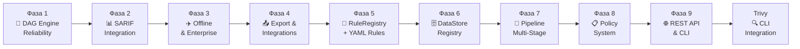

**Пояснение:**  
9 фаз + Trivy-интеграция разделены на два блока. **Фазы 1-4** (из Black Duck 2.8.0): reliability DAG, SARIF 2.1.0, enterprise/offline, export/integrations. **Фазы 5-9** (из Tracee v33.33.34): декларативные правила валидации, реестр DataStore для обогащения, multi-stage pipeline, профили валидации, REST API. Порядок строго выдержан: каждая последующая фаза опирается на функциональность предыдущей.

---

# Часть I — Фазы 1-4 (Black Duck)

---

## Фаза 1 — Надёжность DAG Engine ✅

### Описание
Повышение отказоустойчивости DAG-движка: retry для внешних процессов, агрегация ошибок валидации, настройка поведения NIST-узла.

### Архитектурная диаграмма

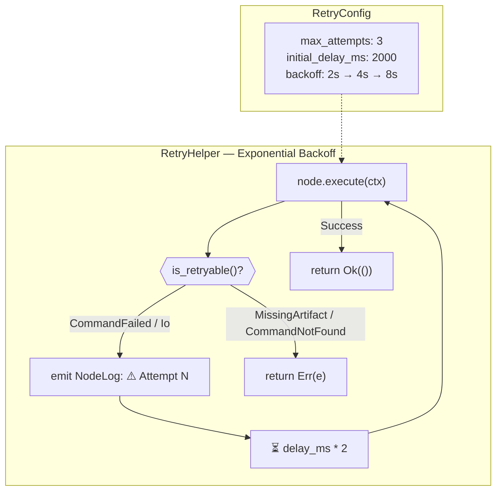

**Пояснение:**  
`RetryConfig` — структура в `context.rs`, определяющая параметры повторных попыток: максимальное число попыток (3) и начальную задержку (2000мс). Задержка удваивается при каждой попытке (exponential backoff: 2с→4с→8с). Метод `is_retryable()` в `ExecutionError` позволяет различать транзиентные ошибки (`CommandFailed`, `Io`) от стабильных (`MissingArtifact`, `CommandNotFound`). Каждая повторная попытка логируется через `EngineEvent::NodeLog` для видимости в UI.

### Агрегация ошибок auto-wiring

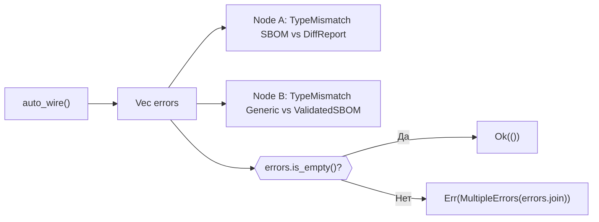

**Пояснение:**  
Ранее `auto_wire()` прекращал работу на первой ошибке `TypeMismatch`. Теперь все ошибки собираются в `Vec<String>` и возвращаются как единый `MultipleErrors`. Это даёт пользователю полную картину всех проблем wiring за один запуск.

### Configurable NIST build status

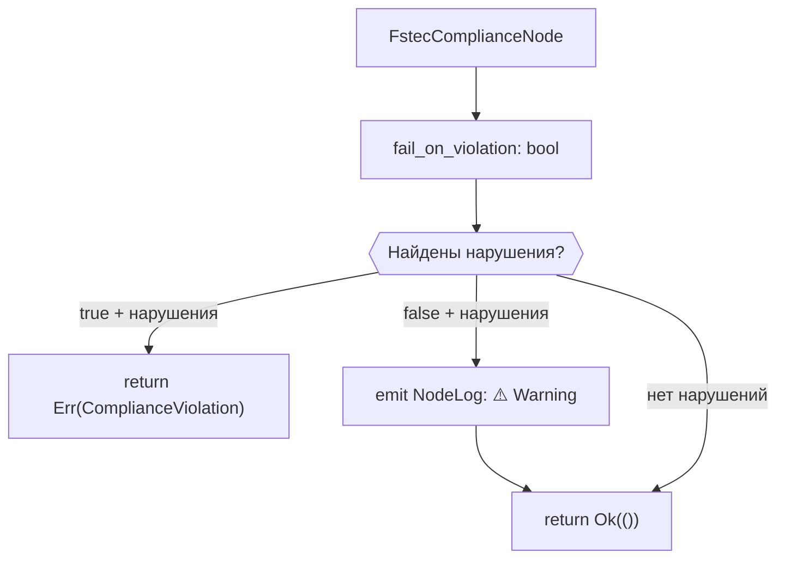

**Пояснение:**  
Поле `fail_on_violation` на `FstecComplianceNode` позволяет выбирать режим: если `true` — нарушения NIST блокируют пайплайн с ошибкой `ComplianceViolation`; если `false` (по умолчанию) — только предупреждение в логах. Настраивается через JSON конфигурацию узла: `{"fail_on_violation": true}`.

### Изменённые файлы

| Файл | Изменение |
|------|-----------|
| `context.rs` | `RetryConfig` struct + поле в `ExecutionContext` |
| `nodes.rs` | `MultipleErrors`, `ComplianceViolation`, `is_retryable()`, `fail_on_violation` |
| `graph.rs` | Агрегация ошибок в `auto_wire()` |
| `mod.rs` | Retry loop с exponential backoff |

---

## Фаза 2 — SARIF Интеграция ✅

### Описание
Генерация отчётов в формате SARIF 2.1.0 из результатов NIST-проверок + UI-компонент для визуализации.

### Архитектурная диаграмма — SarifExportNode

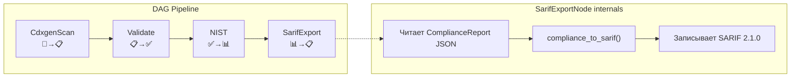

**Пояснение:**  
`SarifExportNode` — новый узел DAG, принимающий `ComplianceReport` и генерирующий `SarifReport`. Функция `compliance_to_sarif()` конвертирует каждый NIST-check в SARIF result: `ruleId` формируется из имени требования, `level` маппится (FAIL→error, WARN→warning, PASS→note), добавляется `message` и `location`.

### SARIF 2.1.0 структура

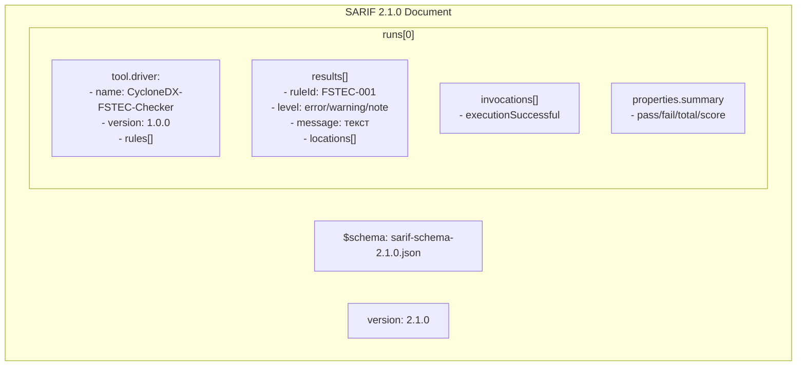

**Пояснение:**  
Генерируемый SARIF-документ полностью совместим со стандартом 2.1.0 OASIS. Каждое правило описывается как `ReportingDescriptor` в `rules[]`, а результаты проверок — как `Result` в `results[]`. Секция `invocations` указывает на общий успех (нет failures), `properties.summary` сохраняет метрики NIST-отчёта.

### SarifViewer — React компонент

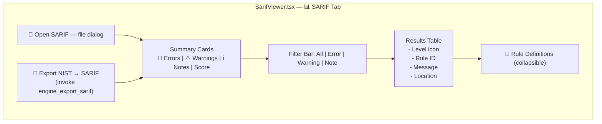

**Пояснение:**  
`SarifViewer.tsx` (250 LOC) — полнофункциональный просмотрщик SARIF. Две кнопки: открытие существующего файла и экспорт NIST-отчёта в SARIF (вызывает Tauri-команду `engine_export_sarif`). Summary cards показывают количество ошибок, предупреждений, заметок. Filter bar позволяет фильтровать по severity. Таблица с цветовой индикацией (красный/жёлтый/синий) по уровню.

### Новые файлы и команды

| Файл | Описание |
|------|----------|
| `artifact.rs` | `SarifReport` variant + compatibility ComplianceReport→SarifReport |
| `nodes.rs` | `SarifExportNode` + `compliance_to_sarif()` (155 LOC) |
| `mod.rs` | `build_node("sarif_export")` + `engine_export_sarif` команда |
| `SarifViewer.tsx` | Новый React-компонент (250 LOC) |
| `AppLayout.tsx` | Новая вкладка `📊 SARIF` |

---

## Фаза 3 — Offline и Enterprise ✅

### Описание
Поддержка air-gap окружений, прокси-серверов, SSL-сертификатов, автоматическое определение установленных инструментов.

### Архитектурная диаграмма — config.rs

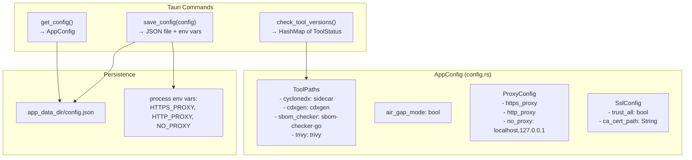

**Пояснение:**  
Модуль `config.rs` (195 LOC) предоставляет персистентную конфигурацию приложения. `AppConfig` объединяет пути к инструментам, режим air-gap, настройки прокси и SSL. Конфигурация сохраняется в `config.json` в директории данных приложения. При сохранении `save_config` автоматически применяет прокси через `std::env::set_var`. Команда `check_tool_versions` запускает каждый инструмент с `--version` и возвращает статус доступности с версией.

### SettingsPanel — обновлённый UI

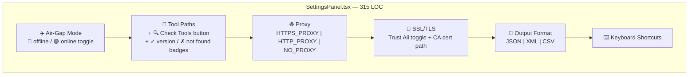

**Пояснение:**  
`SettingsPanel.tsx` расширен с 166 до 315 LOC. Три новые секции: Air-Gap Mode (переключатель с визуальным индикатором), Proxy (три поля для HTTPS/HTTP/NO_PROXY), SSL/TLS (trust all toggle и путь к CA-сертификату). Кнопка «🔍 Check Tools» вызывает Rust-команду `check_tool_versions` и показывает badge-статусы рядом с каждым инструментом: зелёный «✓ v1.2.3» или красный «✗ not found».

---

## Фаза 4 — Экспорт и Интеграции ✅

### Описание
Factory-паттерн для экспорта отчётов, сбор диагностики в ZIP, отправка результатов во внешние системы через webhook.

### Архитектурная диаграмма — export.rs

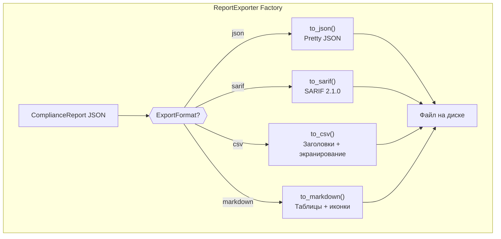

**Пояснение:**  
`ReportExporter` — factory-класс, поддерживающий 4 формата экспорта. `to_json()` — pretty-print. `to_sarif()` — вызывает `compliance_to_sarif()` из Phase 2. `to_csv()` — экранирование двойных кавычек, заголовки Check/Status/Requirement/Detail. `to_markdown()` — таблица с ✅/❌ иконками статуса и секция Summary.

### DiagnosticsCollector — ZIP-архив

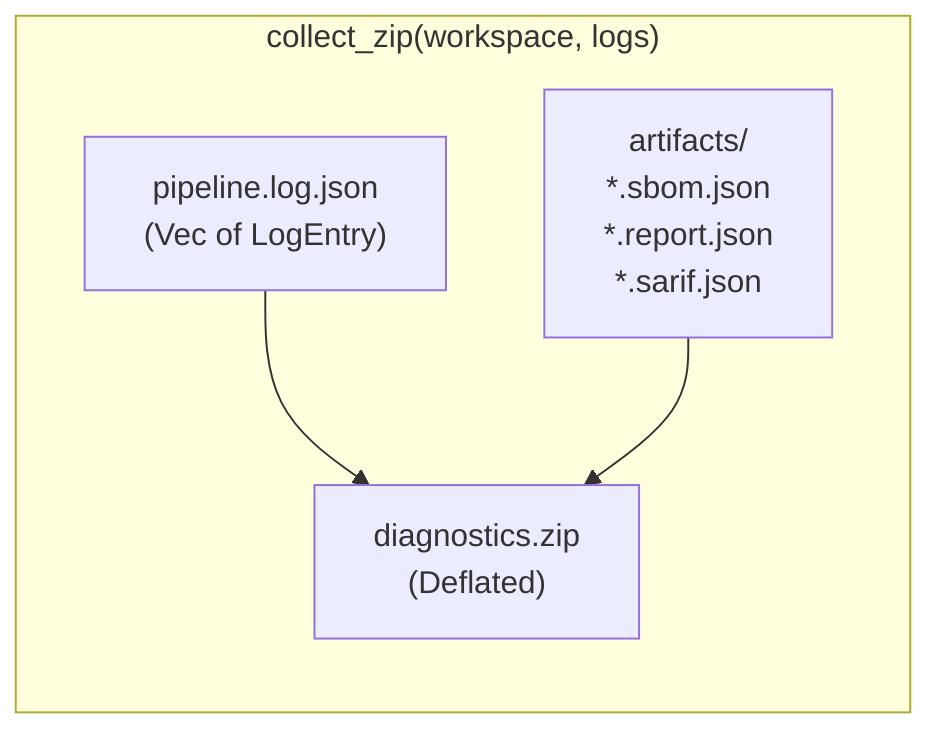

**Пояснение:**  
`DiagnosticsCollector` собирает все файлы директории `workspace/artifacts/` и лог-записи пайплайна в один ZIP-архив. Используется `zip` crate с методом сжатия Deflated. Рекурсивный обход поддиректорий через `add_dir_to_zip()`. Логи сериализуются как JSON-массив `LogEntry` (`timestamp`, `node_id`, `level`, `message`).

### WebhookSender — CI/CD интеграция

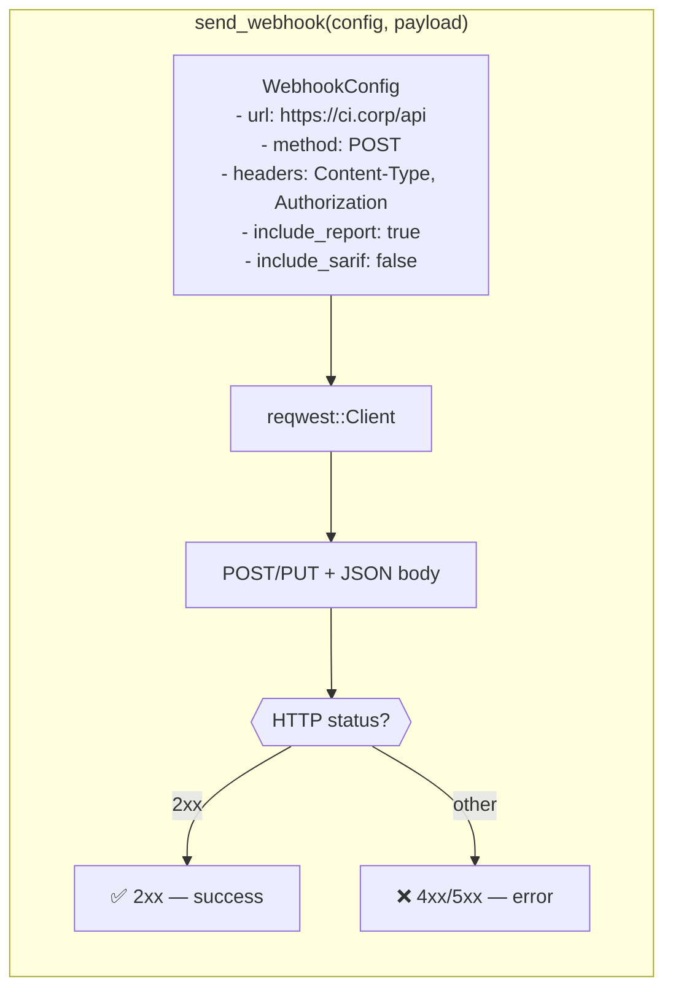

**Пояснение:**  
`WebhookSender` использует `reqwest` для отправки результатов сканирования во внешние системы. `WebhookConfig` поддерживает настройку URL, HTTP-метода (POST/PUT), пользовательских заголовков (Authorization, Content-Type), и флагов включения отчёта и SARIF. Ответ проверяется по HTTP-коду: 2xx — успех, остальное — ошибка с телом ответа.

### Tauri-команды Phase 4

| Команда | Параметры | Описание |
|---------|-----------|----------|
| `export_report` | input_path, output_path, format | Экспорт в JSON/SARIF/CSV/Markdown |
| `collect_diagnostics` | workspace, output_path, logs | Сбор логов+артефактов в ZIP |
| `send_webhook` | config, payload | POST/PUT во внешний endpoint |

---

# Часть II — Фазы 5-9 + Trivy (из Tracee)

---

## Фаза 5 — RuleRegistry + YAML Rules ✅

**Источник**: Tracee `pkg/detectors/registry.go` + `yaml/`

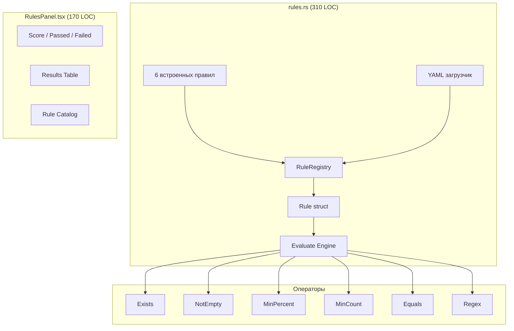

**Пояснение:**  
Модуль `rules.rs` реализует паттерн **Registry** из Tracee: единый реестр, в который загружаются как встроенные (hardcoded) правила, так и пользовательские из YAML-файлов. Каждое правило (`Rule`) содержит: поле SBOM для проверки (JSONPath-подобный путь, например `components[*].licenses`), оператор сравнения (один из 6), порог или паттерн. **Evaluate Engine** проходит по всем правилам, резолвит значение поля через JSONPath-resolver, применяет оператор и возвращает `EvaluationReport` со score (процент прошедших) и detailed results. `RulesPanel.tsx` визуализирует результат: карточки score/passed/failed, таблица с severity-индикаторами, и collapsible каталог всех загруженных правил. YAML-загрузчик читает файлы из `app_data_dir/rules/*.yaml`, позволяя добавлять правила без перекомпиляции.

| Правило | Поле | Оператор | Порог |
|---------|------|----------|-------|
| FSTEC-001 | `metadata` | exists | — |
| FSTEC-002 | `components[*].licenses` | min_percent | 80% |
| FSTEC-003 | `serialNumber` | not_empty | — |
| FSTEC-004 | `components[*].supplier` | min_percent | 50% |
| FSTEC-005 | `components` | min_count | 1 |
| NTIA-001 | `bomFormat` | equals | CycloneDX |

**Команды**: `load_rules`, `evaluate_rules`, `save_rule`

---

## Фаза 6 — DataStore Registry ✅

**Источник**: Tracee `pkg/datastores/registry.go`

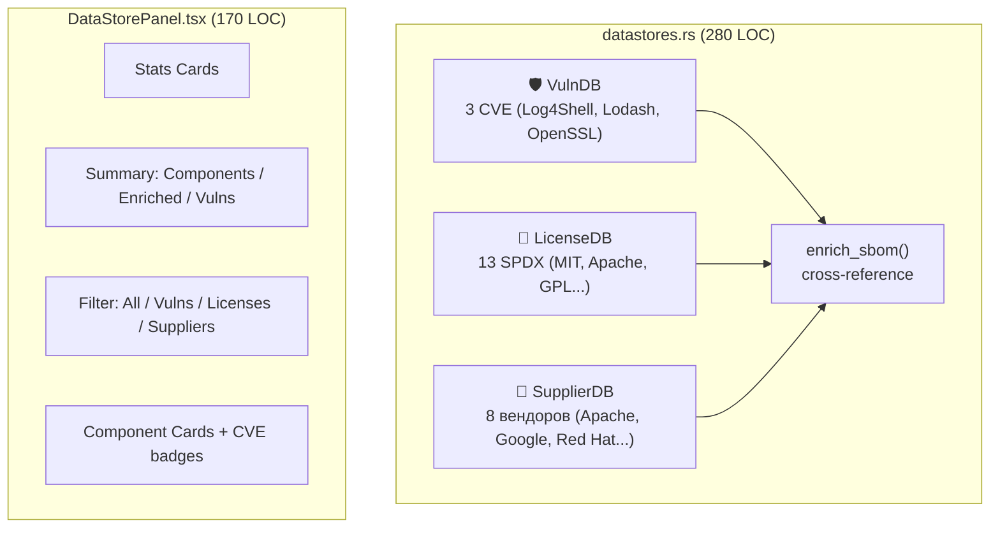

**Пояснение:**  
Архитектура DataStore Registry вдохновлена 7 хранилищами Tracee (`container`, `DNS`, `process`, `symbol`, `syscall`, `system`, `IP reputation`). В контексте SBOM реализованы 3 специализированных хранилища: **VulnDB** — офлайн-кэш известных уязвимостей (3 sample CVE, в production — загрузка из NVD/OSV), **LicenseDB** — 13 SPDX-лицензий с категоризацией (permissive/copyleft/weak-copyleft/proprietary) и флагами OSI/FSF, **SupplierDB** — 8 вендоров с trusted-флагами для NIST-проверок. Ключевая функция `enrich_sbom()` проходит по всем компонентам SBOM и cross-references каждый с тремя хранилищами, формируя `EnrichmentReport` с агрегированной статистикой (total_vulns, critical, high). `DataStorePanel.tsx` предоставляет UI с фильтрацией по типу обогащения и CVE-badges на карточках компонентов.

**Команды**: `query_vuln`, `query_license`, `enrich_sbom`, `datastore_stats`

---

## Фаза 7 — Pipeline Multi-Stage ✅

**Источник**: Tracee `events_pipeline.go` (decode→match→process→derive→detect→sink)

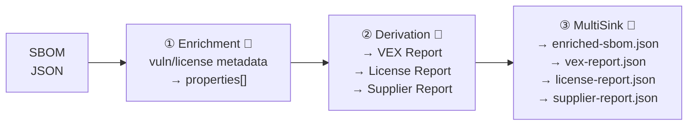

**Пояснение:**  
Дизайн pipeline вдохновлён 6-стадийным конвейером Tracee (`decodeEvents → matchPolicies → processEvents → deriveEvents → detectEvents → sinkEvents`). Для SBOM реализованы 3 стадии, выполняемые последовательно: **① Enrichment** — мутирует SBOM in-place, добавляя в `properties[]` каждого компонента метаданные об уязвимостях (`enrichment:vulns`) и категории лицензии (`enrichment:license_category`). **② Derivation** — «деривирует» (порождает) 3 новых артефакта из обогащённого SBOM: VEX-документ (CycloneDX 1.5 формат), License Report (распределение лицензий + coverage%), Supplier Report (распределение поставщиков + coverage%). **③ MultiSink** — сохраняет все артефакты на диск в output directory. Каждая стадия возвращает `StageResult` с временем выполнения, статусом и списком произведённых артефактов. `PipelineReport` агрегирует все стадии и определяет `overall_status`.

| Стадия | Вход | Выход |
|--------|------|-------|
| Enrichment | SBOM | Enriched SBOM (properties[]) |
| Derivation | SBOM | VEX + License Report + Supplier Report |
| MultiSink | All | 4 JSON файла на диск |

**Команды**: `run_pipeline_stages`, `list_pipeline_stages`

---

## Фаза 8 — Policy System (Validation Profiles) ✅

**Источник**: Tracee `pkg/policy/`

```mermaid
graph TB
    subgraph "policies.rs (310 LOC)"
        Dev["Development<br/>2 rules, не блокирует"]
        Staging["Staging<br/>4 rules, не блокирует"]
        Prod["Production<br/>6 rules, БЛОКИРУЕТ"]
        FSTEC["NIST<br/>7 rules, БЛОКИРУЕТ"]
        NTIA["NTIA<br/>5 rules, БЛОКИРУЕТ"]
        CRA["EU CRA<br/>4 rules, БЛОКИРУЕТ"]
    end

    subgraph "Evaluate"
        Evaluate["evaluate_profile()"]
        Verdict["Verdict:<br/>PASS / FAIL / WARNING"]
    end

    Dev --> Evaluate
    Staging --> Evaluate
    Prod --> Evaluate
    FSTEC --> Evaluate
    NTIA --> Evaluate
    CRA --> Evaluate
    Evaluate --> Verdict
```

**Пояснение:**  
Policy System реализует паттерн **Validation Profiles** из Tracee `pkg/policy/` (PolicyManager + Snapshots). Каждый профиль — именованный набор правил с флагом `fail_on_violation`: профили Development и Staging — для разработки (warnings, не блокируют CI), Production и compliance-профили (NIST, NTIA, EU CRA) — блокирующие (возвращают verdict=FAIL при нарушениях). Функция `evaluate_profile()` загружает профиль, оценивает SBOM по каждому правилу через тот же evaluate engine что и в Фазе 5, и формирует `ProfileEvaluation` со score (0-100%), verdict (PASS/FAIL/WARNING) и per-rule results. Профили хранятся как YAML в `app_data_dir/profiles/`, пользователь может создавать custom-профили через `save_profile()`. Иерархия строгости: Dev (2 rules) → Staging (4) → Prod (6) → NIST (7) → NTIA (5) → EU CRA (4).

| Профиль | Правил | Блокирует | Ключевые проверки |
|---------|--------|-----------|-------------------|
| Development | 2 | Нет | bomFormat, components ≥1 |
| Staging | 4 | Нет | +metadata, +licenses ≥50% |
| Production | 6 | **Да** | +serialNumber, +licenses ≥80% |
| NIST | 7 | **Да** | +versions ≥90%, +purl ≥70% |
| NTIA | 5 | **Да** | timestamp, names/versions 100%/95% |
| EU CRA | 4 | **Да** | licenses ≥90%, suppliers ≥80% |

**Команды**: `list_profiles`, `evaluate_profile`, `save_profile`

---

## Фаза 9 — REST API & CLI ✅

**Источник**: Tracee `pkg/server/` + `traceectl`

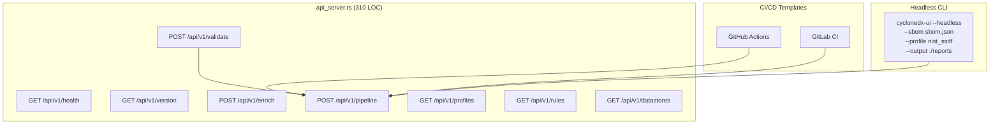

**Пояснение:**  
Модуль API вдохновлён двойной архитектурой Tracee: `pkg/server/` (gRPC + HTTP endpoints) + `traceectl` (CLI-клиент). Реализованы 8 REST endpoints для headless-режима: health/version (мониторинг), validate/enrich/pipeline (бизнес-операции), profiles/rules/datastores (справочные данные). Ключевой endpoint `POST /api/v1/pipeline` запускает полный цикл: enrich → validate → export. Для CI/CD предоставлены готовые шаблоны GitHub Actions (`sbom-validate.yml`) и GitLab CI (`.gitlab-ci.yml`). CLI headless-режим (`cyclonedx-ui --headless`) позволяет использовать приложение без GUI — критично для автоматизации в CI-пайплайнах. Результат pipeline сохраняется как `pipeline-result.json` с timestamp. `AtomicBool` отслеживает статус API-сервера.

**Команды**: `api_server_status`, `run_headless`, `get_ci_templates`, `get_cli_usage`

---

## Trivy CLI Integration ✅

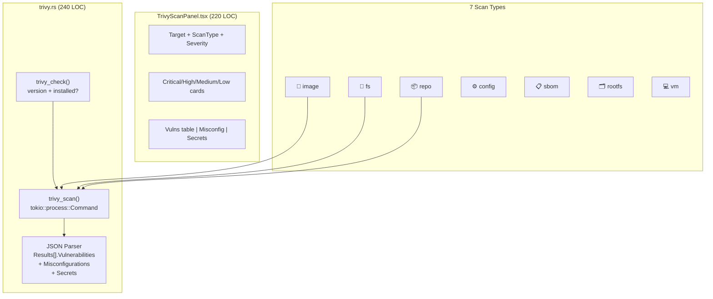

**Пояснение:**  
Trivy интеграция превращает CycloneDX Tauri UI из инструмента работы с SBOM в полноценный security scanner с GUI. `trivy.rs` вызывает `trivy` CLI как subprocess через `tokio::process::Command` с аргументом `--format json` и парсит стандартный JSON-вывод. Парсер обрабатывает три типа результатов из массива `Results[]`: **Vulnerabilities** (CVE ID, severity, affected package, installed/fixed version, primary URL), **Misconfigurations** (ID, title, severity, message, resolution), **Secrets** (rule ID, category, title, match). `TrivyScanPanel.tsx` предоставляет полный UI: форма ввода (target + scan type + severity filter), badge с версией Trivy, summary-карточки по severity, три вкладки результатов. Поддерживает 7 типов сканирования: container images (Docker Hub), файловые системы, Git-репозитории, IaC-конфигурации, SBOM-файлы, rootfs и VM-образы. При отсутствии Trivy показывает ссылку на установку.

**Команды**: `trivy_scan`, `trivy_check`

---

## Итоговая сводка всех фаз

| Фаза | Модуль | LOC | UI компонент | LOC | Команды |
|------|--------|-----|-------------|-----|---------|
| 1 — DAG Reliability | engine/ (mod) | ~100 | — | — | — |
| 2 — SARIF | SarifExportNode | ~450 | `SarifViewer.tsx` | 250 | 1 |
| 3 — Offline/Enterprise | `config.rs` | ~510 | `SettingsPanel.tsx` | 315 | 3 |
| 4 — Export/Integrations | `export.rs` | ~260 | — | — | 3 |
| 5 — Rules | `rules.rs` | 310 | `RulesPanel.tsx` | 170 | 3 |
| 6 — DataStores | `datastores.rs` | 280 | `DataStorePanel.tsx` | 170 | 4 |
| 7 — Pipeline | `pipeline_stages.rs` | 310 | — | — | 2 |
| 8 — Policies | `policies.rs` | 310 | — | — | 3 |
| 9 — API/CLI | `api_server.rs` | 310 | — | — | 4 |
| Trivy | `trivy.rs` | 240 | `TrivyScanPanel.tsx` | 220 | 2 |
| **Итого** | **10 модулей** | **~3080** | **5 компонентов** | **~1125** | **25** |
