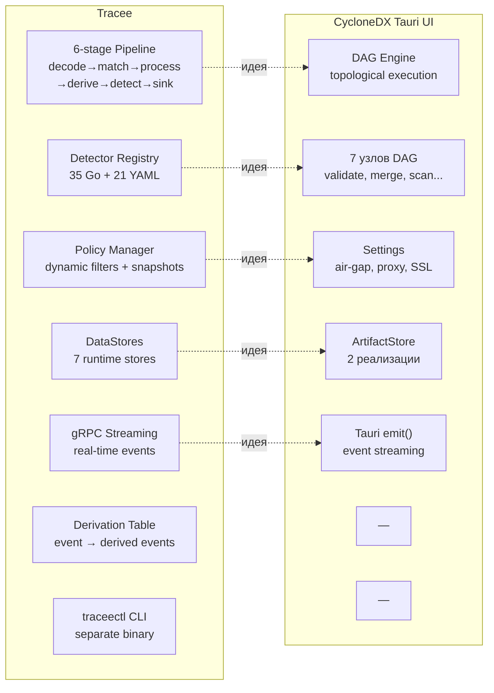
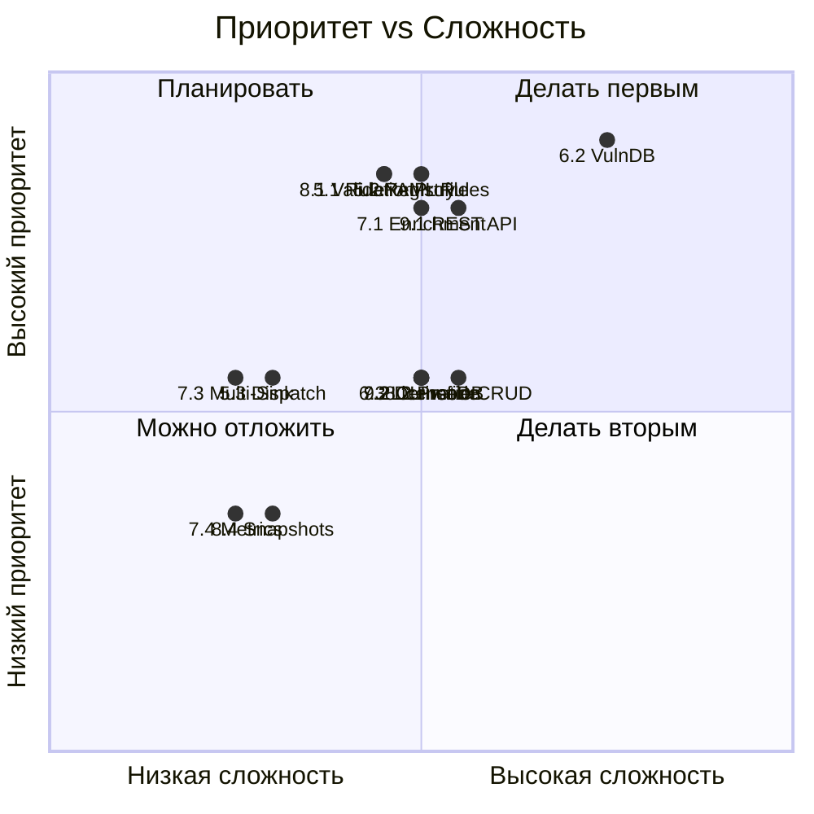

# Идеи из Tracee → CycloneDX Tauri UI

> **Дата**: 2026-03-05  
> **Источник**: Tracee v33.33.34 (Aqua Security)  
> **Цель**: CycloneDX Tauri UI v0.2.0+

---

## Сравнение архитектур



---

## Фазы развития CycloneDX Tauri UI (из Tracee)

### Фаза 5 — Детекторы и правила (Registry Pattern)

Tracee: 35 Go-сигнатур + 21 YAML-правил через `Detector Registry` + `Dispatch`.  
**Идея**: Создать аналогичный `RuleRegistry` для CycloneDX — декларативные YAML-правила проверки SBOM.

| # | Задача | Источник в Tracee | Приоритет | Сложность |
|---|--------|------------------|-----------|-----------|
| 5.1 | **RuleRegistry** — реестр проверочных правил (Rust trait + HashMap) | `pkg/detectors/registry.go` (23KB) | 🔴 Высокий | Средняя |
| 5.2 | **YAML Rule Engine** — загрузка правил из YAML без перекомпиляции | `pkg/detectors/yaml/` (21 файл) | 🔴 Высокий | Средняя |
| 5.3 | **Rule Dispatch** — маршрутизация SBOM → правила по типу/scope | `pkg/detectors/dispatch.go` (12KB) | 🟡 Средний | Низкая |
| 5.4 | **Custom NIST Rules** — YAML-правила для конкретных требований NIST | — | 🟡 Средний | Низкая |

**Пример YAML-правила:**
```yaml
id: FSTEC-LICENSE-CHECK
name: "Проверка лицензий компонентов"
description: "Все компоненты SBOM должны иметь лицензию"
severity: error
scope:
  artifact_types: [SBOM, ValidatedSBOM]
condition:
  field: "components[*].licenses"
  operator: "not_empty"
  threshold: 80  # минимум 80% с лицензиями
```

---

### Фаза 6 — DataStore Registry (Enrichment Pattern)

Tracee: 7 DataStores (container, DNS, process, symbol, syscall, system, IP rep) через единый `Registry`.  
**Идея**: Создать `DataSourceRegistry` для обогащения SBOM внешними данными.

| # | Задача | Источник в Tracee | Приоритет | Сложность |
|---|--------|------------------|-----------|-----------|
| 6.1 | **DataSourceRegistry** — единый реестр источников данных | `pkg/datastores/registry.go` (10KB) | 🟡 Средний | Средняя |
| 6.2 | **VulnDB Store** — кэш уязвимостей (OSV, NVD) для offline-enrichment | `pkg/datastores/ipreputation/` | 🔴 Высокий | Высокая |
| 6.3 | **LicenseDB Store** — SPDX license database для валидации | `pkg/datastores/dns/` (кэш паттерн) | 🟡 Средний | Средняя |
| 6.4 | **SupplierDB Store** — база поставщиков для NIST-проверок | — | 🟢 Низкий | Низкая |

---

### Фаза 7 — Pipeline-стадии (Multi-Stage Pattern)

Tracee: 6 стадий pipeline с goroutine-каналами (decode→match→process→derive→detect→sink).  
**Идея**: Расширить DAG Engine стадиями pre/post-processing.

| # | Задача | Источник в Tracee | Приоритет | Сложность |
|---|--------|------------------|-----------|-----------|
| 7.1 | **Enrichment Stage** — автоматическое обогащение SBOM данными из DataStores | `processEvents` (enrichment) | 🔴 Высокий | Средняя |
| 7.2 | **Derivation Stage** — вывод производных артефактов (SBOM → VEX, SBOM → License Report) | `deriveEvents` (derivation table) | 🟡 Средний | Средняя |
| 7.3 | **Sink Stage** — множественные выходы: файл + gRPC + webhook одновременно | `sinkEvents` (multi-printer) | 🟡 Средний | Низкая |
| 7.4 | **Pipeline Metrics** — Prometheus-метрики для каждой стадии | `pkg/metrics/` | 🟢 Низкий | Низкая |

---

### Фаза 8 — Policy System (Dynamic Filtering)

Tracee: `PolicyManager` с dynamic filters, atomic snapshots, eBPF filter maps.  
**Идея**: Динамические политики для SBOM-валидации — профили проверок по окружению.

| # | Задача | Источник в Tracee | Приоритет | Сложность |
|---|--------|------------------|-----------|-----------|
| 8.1 | **ValidationProfile** — профили валидации (dev/staging/prod/NIST) | `pkg/policy/policy.go` (3KB) | 🔴 Высокий | Средняя |
| 8.2 | **Profile CRUD** — UI для создания/редактирования профилей | `pkg/policy/policy_manager.go` (17KB) | 🟡 Средний | Средняя |
| 8.3 | **Profile Templates** — предустановленные шаблоны (NIST, NTIA-min, CRA) | — | 🟡 Средний | Низкая |
| 8.4 | **Policy Snapshots** — версионирование профилей для аудита | `pkg/policy/snapshots.go` (4KB) | 🟢 Низкий | Низкая |

---

### Фаза 9 — gRPC API & CLI (Remote Control)

Tracee: gRPC-сервер + `traceectl` CLI + Proto definitions.  
**Идея**: Headless-режим CycloneDX Tauri UI с gRPC API для CI/CD автоматизации.

| # | Задача | Источник в Tracee | Приоритет | Сложность |
|---|--------|------------------|-----------|-----------|
| 9.1 | **REST API** — HTTP API для запуска пайплайнов без UI | `pkg/server/http/` | 🔴 Высокий | Средняя |
| 9.2 | **CLI mode** — `cyclonedx-ui --headless --pipeline pipeline.json` | `cmd/traceectl/` | 🟡 Средний | Средняя |
| 9.3 | **Event Streaming** — SSE/WebSocket для real-time pipeline progress | `gRPC streaming` | 🟡 Средний | Средняя |
| 9.4 | **CI Integration** — GitHub Actions / GitLab CI template | — | 🟡 Средний | Низкая |

---

## Матрица приоритетов



---

## Рекомендованный порядок реализации

| Приоритет | Фаза | Ключевая ценность | Усилие |
|-----------|------|-------------------|--------|
| **1** | Фаза 5 — Детекторы | YAML-правила без перекомпиляции → гибкость | 2-3 дня |
| **2** | Фаза 8 — Политики | Профили dev/prod/NIST → Compliance-as-Code | 1-2 дня |
| **3** | Фаза 6 — DataStores | VulnDB + LicenseDB → offline enrichment | 2-3 дня |
| **4** | Фаза 7 — Pipeline | Enrichment + derivation → автоматизация | 2-3 дня |
| **5** | Фаза 9 — API & CLI | Headless + CI/CD → enterprise adoption | 3-4 дня |
