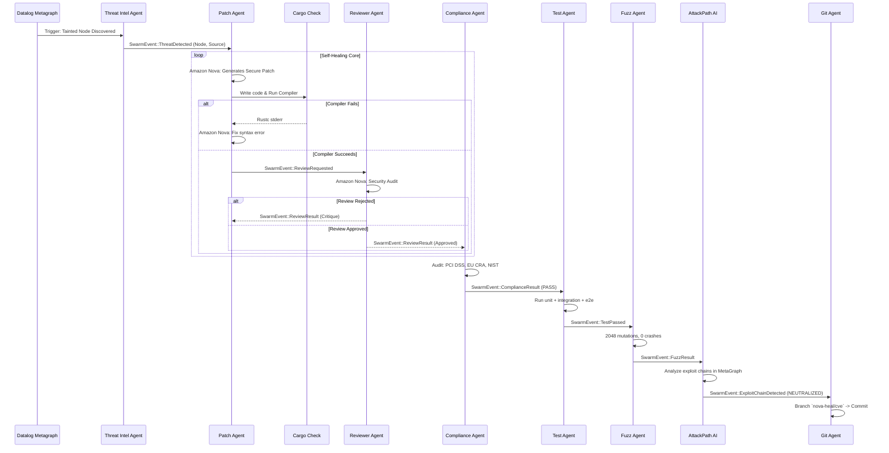
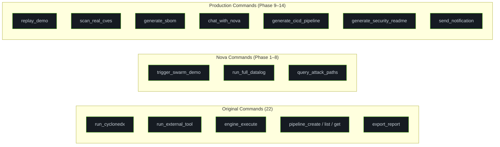
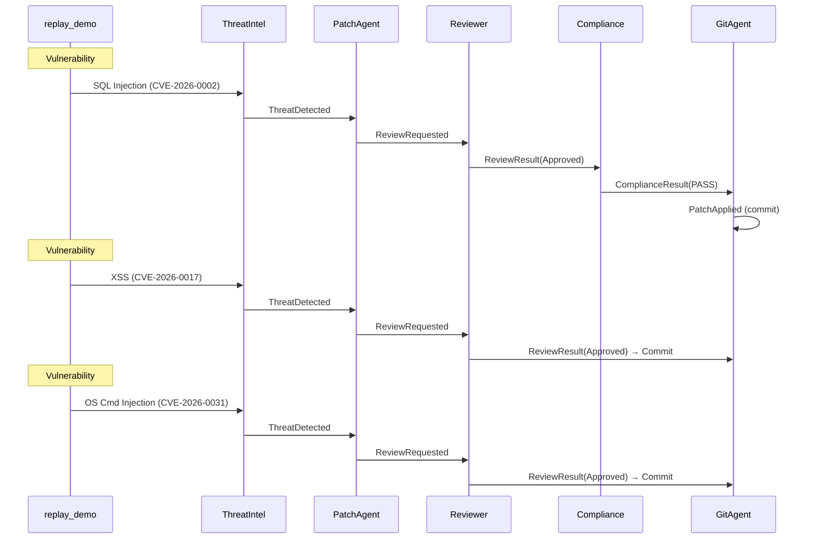
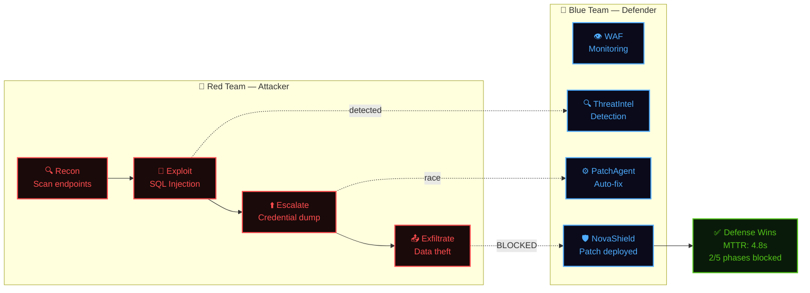

# Autonomous Graph-Driven DevSecOps Engine

> 5 paradigms: Erlang/OTP Actors + Datalog Reasoning + Multi-Agent AI + Reactive Graph + Self-Healing Pipeline

This document contains the core Mermaid diagrams for the pitch deck.

## 1. Unified DevSecOps Graph Strategy

```mermaid
graph TD
    classDef ai fill:#2a2a4a,stroke:#4facfe,stroke-width:2px,color:#fff
    classDef graph fill:#1a1a30,stroke:#eb2f96,stroke-width:2px,color:#fff
    classDef source fill:#0f172a,stroke:#3b82f6,stroke-width:2px,color:#fff

    subgraph "Continuous Parsing"
        A[Git Source Code]:::source -->|rust-analyzer / tree-sitter| B(AST Graph)
        C[Cargo.toml / lock]:::source -->|CycloneDX| D(SBOM Graph)
    end

    subgraph "Knowledge Graphs"
        B :::graph --> E{Unified Meta-Graph}:::graph
        D :::graph --> E
        E --> F[Runtime Execution Data]
    end

    subgraph "Datalog Engine (SecQL)"
        E --> G[(Crepe DB)]:::graph
        G -->|FlowsTo, Tainted| H[Deep Vulnerability Tracing]
    end

    subgraph "Agentic Layer (Amazon Nova)"
        H --> I(Threat Intel Agent):::ai
        I --> J(Patch Generator Agent):::ai
        J --> K(Code Reviewer Agent):::ai
        K --> L(Compliance Agent):::ai
        L --> M(Git Agent):::ai
    end
```

## 2. Multi-Agent Swarm Self-Healing Loop (7 Agents)



## 3. Actor Registry Architecture (7 Agents + Telemetry)

```mermaid
graph LR
    classDef actor fill:#161b22,stroke:#8b949e,color:#c9d1d9
    classDef bus fill:#1f6feb,stroke:#58a6ff,color:#fff

    Bus((SwarmBus<br/>mpsc::broadcast)):::bus

    TA[Threat Intel]:::actor <-->|Pub/Sub| Bus
    PA[Patch Agent]:::actor <-->|Pub/Sub| Bus
    RA[Reviewer Agent]:::actor <-->|Pub/Sub| Bus
    CA[Compliance Agent]:::actor <-->|Pub/Sub| Bus
    TSA[Test Agent]:::actor <-->|Pub/Sub| Bus
    FA[Fuzz Agent]:::actor <-->|Pub/Sub| Bus
    APA[AttackPath AI]:::actor <-->|Pub/Sub| Bus
    GA[Git Agent]:::actor <-->|Pub/Sub| Bus
    UI[Tauri Frontend]:::actor <-->|listen()| Bus

    %% Telemetry
    Bus -.->|Pulse UI Events| UI
```

## 4. Frontend Component Architecture (Phase 9–14)

```mermaid
graph TB
    classDef nova fill:#1a1a30,stroke:#eb2f96,stroke-width:2px,color:#fff
    classDef tool fill:#161b22,stroke:#4facfe,stroke-width:1px,color:#c9d1d9
    classDef overlay fill:#2a2a4a,stroke:#722ed1,stroke-width:1px,color:#fff

    subgraph "NOVA SHIELD — 11 Tabs"
        PD[🚀 PitchDashboard<br/>Live Telemetry + Neural Graph]:::nova
        SA[🐝 SwarmActivityModule<br/>Event Cards + Diff Viewer]:::nova
        AG[🔴 LiveAttackGraph<br/>Attack Path Visualization]:::nova
        PG[🧬 PulseGraph<br/>Actor Communication]:::nova
        ST[🔧 SecurityToolsPanel<br/>7 Sub-Tabs]:::tool
        PS[🎬 PitchSlides<br/>6-Slide Deck, Fullscreen]:::tool
        AFP[🎯 AdvancedFeaturesPanel<br/>5 Sub-Tabs]:::tool
        DTP[🌳 DependencyTreePanel<br/>Interactive Cargo Tree]:::tool
        ES[📱 ExecutiveSummary<br/>CTO Report]:::tool
    end

    subgraph "Global Overlays"
        CP[⌨️ CommandPalette<br/>Ctrl+K, 15+ Commands]:::overlay
    end

    subgraph "SecurityToolsPanel — 7 Tabs"
        SS[📈 Security Score Radar]
        NC[💬 Nova Chat]
        SB[📦 SBOM Export]
        CI[🔗 CI/CD Generator]
        HM[🗺️ Attack Heatmap]
        RM[📜 SECURITY.md]
        NT[🔔 Desktop Alerts]
    end

    subgraph "AdvancedFeaturesPanel — 5 Tabs"
        AP[⏱️ Agent Profiler]
        ML[🌐 Multi-Lang 6 Languages]
        TT[📊 Threat Timeline]
        AC[🏆 Achievements 8 Badges]
        LD[🎯 Live Demo Script]
    end

    ST --> SS & NC & SB & CI & HM & RM & NT
    AFP --> AP & ML & TT & AC & LD
```



## 5. Tauri Commands — Backend API (46 Commands)



## 6. Multi-Vulnerability Cascade (Demo Scenario)



## 7. Hyperscale Architecture — Full Stack

```mermaid
graph TB
    classDef graph fill:#0d1117,stroke:#58a6ff,stroke-width:2px,color:#c9d1d9
    classDef meta fill:#161b22,stroke:#f0883e,stroke-width:2px,color:#f0883e
    classDef reason fill:#1a1a30,stroke:#eb2f96,stroke-width:2px,color:#eb2f96
    classDef bus fill:#1f6feb,stroke:#58a6ff,color:#fff
    classDef agent fill:#161b22,stroke:#4facfe,stroke-width:1px,color:#c9d1d9
    classDef git fill:#238636,stroke:#3fb950,stroke-width:2px,color:#fff

    subgraph "Layer 1: Graph-of-Graphs"
        AST["🌳 AST Graph<br/>syn parser"]:::graph
        SBOM["📦 SBOM Graph<br/>CycloneDX 1.5"]:::graph
        DEP["🔗 Dependency Graph<br/>Cargo.lock"]:::graph
        ATTACK["🔴 Attack Graph<br/>petgraph Dijkstra"]:::graph
        TRUST["🛡️ Trust Graph<br/>BFS propagation"]:::graph
        BUILD["⚙️ Build Graph<br/>Pipeline DAG"]:::graph
    end

    subgraph "Layer 2: Unified Reasoning"
        META["🧠 MetaGraph<br/>Graph-of-Graphs"]:::meta
        DATALOG["📐 Datalog Engine<br/>Crepe: FlowsTo, Tainted"]:::reason
        REASONING["🔎 Security Reasoning<br/>Exploit Path Search"]:::reason
    end

    subgraph "Layer 3: Event Bus"
        BUS(("⚡ SwarmBus<br/>broadcast::Sender<br/>9 SwarmEvent variants")):::bus
    end

    subgraph "Layer 4: Agent Swarm"
        TI["🔍 ThreatIntel"]:::agent
        PA["⚙️ PatchAgent"]:::agent
        CR["🛡️ Reviewer"]:::agent
        CA["📋 Compliance"]:::agent
        TA["🧪 TestAgent"]:::agent
        FA["🔀 FuzzAgent"]:::agent
        AP["🔎 AttackPathAI"]:::agent
    end

    subgraph "Layer 5: Integration"
        GIT["💾 Git Agent<br/>Auto-branch + Commit"]:::git
    end

    AST & SBOM & DEP & ATTACK & TRUST & BUILD --> META
    META --> DATALOG
    DATALOG --> REASONING
    REASONING --> BUS
    BUS <--> TI & PA & CR & CA & TA & FA & AP
    PA & CR & CA --> GIT
```

### Data Flow Pipeline

```
Codebase → AST Graph → MetaGraph → Datalog → Event Bus → Agent Swarm (8) → Exploit Simulation → Self-Healing Git Patch
```

## 8. Exploit Simulation Engine — Red Team vs Blue Team


